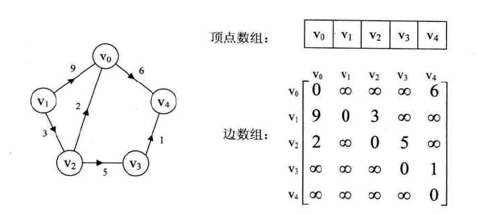
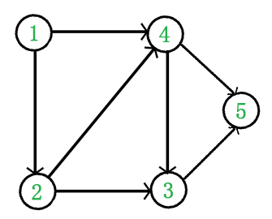

# 数据结构--图（Graph）

- [表示方法](#表示方法)
  - [邻接矩阵](#邻接矩阵)
  - [邻接表](#邻接表)
- [最短路径](#最短路径)
- [拓扑排序](#拓扑排序)
- [经典例题](#经典例题)

## 表示方法

图有两种表示方法，一种是邻接矩阵，其实是一个二维数组；另一种是邻接表，其实是一个顶点表，每个顶点又拥有一个边列表。

### 邻接矩阵

表示图的一种简单的方法是使用一个一维数组和一个二维数组，称为邻接矩阵（adjacent matrix）。

对于每条边（u，v），置A[u，v]等于true，否则，数组的元素就是false。

如果边有一个权，那么可以置A[u，v]等于该权，而使用一个很大或者很小的权来标记不存在的边。

虽然，这样表示很简单，但是，它的空间需求则是$O(|V|^2)$。若图的边不是很多（稀疏（sparse）的有向图），这种表示的代价就太大了。若图是稠密（dense）的：$|E|=O(|V|^2)$，则邻接矩阵是合适的方法。



### 邻接表

如果图是**稀疏的**，那么更好的解决方法是使用邻接表（adjacency list）表示。邻接表是一个二维容器，第一维是一个数组，存储所有顶点，第二维是链表，存储所有与这个点衔接的点集。此时的空间需求为$O(|E|+|V|)$，它相对于图的大小而言是线性的。

**领接表是表示图的标准方法。**无向图也可以用类似的方法表示，但每条边将会出现在两个表中，造成空间的双倍冗余。

实现邻接表的方法有很多，基本的选择有两个：

- 使用一个映射，在这个映射下，关键字是顶点，**值是那些邻接表**
- 关键字是顶点，**值是一个包含链的类Vertex**

```java
// 图的顶点
class Vertex {
    String label; // 标识节点
    Vertex(String label) {
        this.label = label;
    }
}
// 图的边
class Edge {
    String tail; // 尾部节点
    int weight; // 边的权重值
    Edge(String tail, int weight) {
        this.tail = tail;
        this.weight = weight;
    }
}
// 图
Class Graph {
    Vertex[] vertexes;
    LinkedList<Edge> adj[];
    Graph(int size) {
        vertexes = new Vertex[size];
        adj = new LinkedList<Edge>[size];
        for(int i = 0; i < adj.length; ++i){
            adj[i] = new LinkedList<Edge>();
        }
    }
}
```

## 最短路径


## 拓扑排序

在图论中，拓扑排序（Topological Sorting）是一个**有向无环图（DAG，Directed Acyclic Graph）**的所有顶点的线性序列。且该序列满足下面两个条件：

1. 每个顶点出现且仅出现一次
2. 若存在一条从顶点A到顶点B的路劲，那么在序列中顶点A出现在顶点B的前面

有向无环图（DAG）才有拓扑排序，非DGA图没有拓扑排序一说。

例如，下面这个图，它是一个DGA图，那么如何写出它的拓扑排序呢？



方法步骤为：

1. 从DAG图中选择一个没有前驱（即入度为0）的顶点并输出；
2. 从图中删除该顶点和所有以它为起点的有向边；
3. 重复1和2直到当前的**DAG图为空**或**不存在无前驱的顶点为止**。后一种情况说明有向图中必然存在环。


## 经典例题


