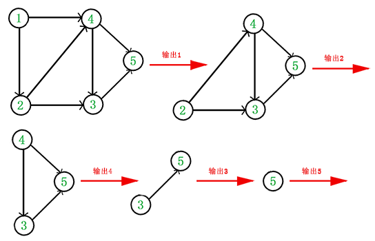

# 数据结构--图（Graph）

- [图的类别](#图的类别)
- [表示方法](#表示方法)
  - [邻接矩阵](#邻接矩阵)
  - [邻接表](#邻接表)
- [最短路径](#最短路径)
- [拓扑排序](#拓扑排序)
- [经典例题](#经典例题)
  - [判断二分图](#判断二分图)
  - [课程表](#课程表)
  - [课程表II](#课程表II)
- [参考链接](#参考链接)

## 图的类别

图是由若干个顶点(Vertices)和边(Edges)相互连接组成的。

- 无向图：即图的边没有方向，边一般用弧形括号表示()
- 有向图：图的边有方向，边一般用尖括号表示<>
- 完全图：图的每两个顶点之间有**边**连接
- 连通图：图的每两个顶点之间有**路劲**连接

## 表示方法

图有两种表示方法，一种是邻接矩阵，其实是一个二维数组；另一种是邻接表，其实是一个顶点表，每个顶点又拥有一个边列表。

### 邻接矩阵

表示图的一种简单的方法是使用一个一维数组和一个二维数组，称为邻接矩阵（adjacent matrix）。

对于每条边（u，v），置A[u，v]等于true，否则，数组的元素就是false。

如果边有一个权，那么可以置A[u，v]等于该权，而使用一个很大或者很小的权来标记不存在的边。

虽然，这样表示很简单，但是，它的空间需求则是$O(|V|^2)$。若图的边不是很多（稀疏（sparse）的有向图），这种表示的代价就太大了。若图是稠密（dense）的：$|E|=O(|V|^2)$，则邻接矩阵是合适的方法。


### 邻接表

如果图是**稀疏的**，那么更好的解决方法是使用邻接表（adjacency list）表示。邻接表是一个二维容器，第一维是一个数组，存储所有顶点，第二维是链表，存储所有与这个点衔接的点集。此时的空间需求为$O(|E|+|V|)$，它相对于图的大小而言是线性的。

**领接表是表示图的标准方法**。无向图也可以用类似的方法表示，但每条边将会出现在两个表中，造成空间的双倍冗余。

实现邻接表的方法有很多，基本的选择有两个：

使用一个映射，在这个映射下，

- 关键字是顶点，**值是那些邻接表**
- 关键字是顶点，**值是一个包含链的类Vertex**

```java
// 图的顶点
class Vertex {
    String label; // 标识节点
    Vertex(String label) {
        this.label = label;
    }
}
// 图的边
class Edge {
    String tail; // 尾部节点
    int weight; // 边的权重值
    Edge(String tail, int weight) {
        this.tail = tail;
        this.weight = weight;
    }
}
// 图
Class Graph {
    Vertex[] vertexes;
    LinkedList<Edge> adj[];
    Graph(int size) {
        vertexes = new Vertex[size];
        adj = new LinkedList<Edge>[size];
        for(int i = 0; i < adj.length; ++i){
            adj[i] = new LinkedList<Edge>();
        }
    }
}
```

---

## 最短路径

### Dijkstra 算法

**dijkstra的算法思想是从以上最短距离数组中每次选择一个最近的点，将其作为下一个点，然后重新计算从起始点经过该点到其他所有点的距离，更新最短距离数据。已经选取过的点就是确定了最短路径的点，不再参与下一次计算。**

知识点：
- **求最小路径，可以用堆进行优化**
- 需要用vst数组记录每个节点的访问情况，初始化为False每次取最短路径对应节点后，将vst置为True
- 需要用dis数组记录从源节点到每个节点的最短路径，初始化源节点到源节点路径为0
 
---

### 0-1 BFS
0-1 BFS 是一种专门用于处理 边权为 0 或 1 的图 的最短路径算法。它比 Dijkstra 更快，时间复杂度为 O(V + E)，适用于图中边权只有 0 和 1 的情况。

**核心思想：**
使用 双端队列（deque） 替代普通队列或优先队列，根据边权选择从队头或队尾插入新的结点：

* 如果当前边权是 0，把目标结点加入队列的 前端（优先处理）。
* 如果当前边权是 1，把目标结点加入队列的 后端（正常顺序）。

这样保证：先处理代价小的路径，实现一个类似 Dijkstra 的效果，但效率更高。

> 在 0-1 BFS 中，不需要 vst（访问标记）数组。
> 
> 用 dist[v] > dist[u] + w 来判断是否值得访问 v。 如果更短，就更新并加入队列；否则不更新也不访问

---

### 参考链接
-   [图文详解 Dijkstra 最短路径算法](https://www.freecodecamp.org/chinese/news/dijkstras-shortest-path-algorithm-visual-introduction/ "图文详解 Dijkstra 最短路径算法")
-   [一篇文章讲透Dijkstra最短路径算法](https://www.cnblogs.com/goldsunshine/p/12978305.html "一篇文章讲透Dijkstra最短路径算法")
-   [Dijkstra 最短路 灵茶山艾府](https://leetcode.cn/problems/find-minimum-time-to-reach-last-room-ii/solutions/2975554/dijkstra-zui-duan-lu-pythonjavacgo-by-en-alms/ "Dijkstra 最短路 灵茶山艾府")

---

### 刷题
- 【模板题】[网络延迟时间](https://leetcode.cn/problems/network-delay-time/description/)
- [到达最后一个房间的最少时间 II](https://leetcode.cn/problems/find-minimum-time-to-reach-last-room-ii/)
- 【0-1 BFS】[3552. 网格传送门旅游](https://leetcode.cn/problems/grid-teleportation-traversal/description/)

---

## 拓扑排序

在图论中，拓扑排序（Topological Sorting）是一个**有向无环图**（DAG，Directed Acyclic Graph）的所有顶点的线性序列。且该序列满足下面两个条件：

1. 每个顶点出现且仅出现一次
2. 若存在一条从顶点A到顶点B的路劲，那么在序列中顶点A出现在顶点B的前面

有向无环图（DAG）才有拓扑排序，非DGA图没有拓扑排序一说。

例如，下面这个图，它是一个DGA图，那么如何写出它的拓扑排序呢？


方法步骤为：

1. 从DAG图中选择一个没有前驱（即入度为0）的顶点并输出；
2. 从图中删除该顶点和所有以它为起点的有向边；
3. 重复1和2直到当前的**DAG图为空**或**不存在无前驱的顶点为止**。后一种情况说明有向图中必然存在环。



## 经典例题

#### 判断二分图

[判断二分图](https://leetcode-cn.com/problems/is-graph-bipartite/)：给定一个无向图graph，当这个图为二分图时返回true。

如果我们能将一个图的节点集合分割成两个独立的子集A和B，并使图中的每一条边的两个节点一个来自A集合，一个来自B集合，我们就将这个图称为二分图。

```
示例 1:	输入: [[1,3], [0,2], [1,3], [0,2]]	输出: true
解释: 	无向图如下:
0----1
|    |
|    |
3----2
我们可以将节点分成两组: {0, 2} 和 {1, 3}。

示例 2:	输入: [[1,2,3], [0,2], [0,1,3], [0,2]]	输出: false
解释: 	无向图如下:
0----1
| \  |
|  \ |
3----2
我们不能将节点分割成两个独立的子集。
```

**[解题思路](https://leetcode.com/problems/is-graph-bipartite/discuss/115487/Java-Clean-DFS-solution-with-Explanation)**：

我们首先使用两种颜色来标记图结点的颜色，然后，通过判断邻接结点中是否有相同颜色来判断二分图。

1. 初始化一个color[]，对于每个结点，有三种状态：
   - 0: Haven't been colored yet.
   - 1: Blue.
   - -1: Red
2. 对于每个结点：
   1. 对于一个没有被标记的节点，我们选择一种颜色标记它，然后用另一种颜色标记它的邻接结点
   2. 如果已经被标记了，判断该颜色是否为我们打算标记的颜色

```java
public boolean isBipartite(int[][] graph) {
    int[] colors = new int[graph.length];
    for(int i = 0; i < graph.length; i++){
        if(colors[i] == 0 && !isBipartite(i, 1, colors, graph)){
            return false;
        }
    }
    return true;
}
private boolean isBipartite(int curNode, int curColor, int[] colors, int[][] graph){
    if(colors[curNode] != 0){
        return colors[curNode] == curColor;
    }
    colors[curNode] = curColor;
    for(int next : graph[curNode]){
        if(!isBipartite(next, -curColor, colors, graph)){
            return false;
        }
    }
    return true;
}
```

---

#### 课程表

[课程表](https://leetcode-cn.com/problems/course-schedule/)：现在你总共有 n 门课需要选，记为 0 到 n-1。

在选修某些课程之前需要一些先修课程。 例如，想要学习课程 0 ，你需要先完成课程 1 ，我们用一个匹配来表示他们: [0,1]

示例 :

```tex
输入: 2, [[1,0]]	输出: true
解释: 总共有 2 门课程。学习课程 1 之前，你需要完成课程 0。所以这是可能的。

输入: 2, [[1,0],[0,1]]	输出: false
解释: 总共有 2 门课程。学习课程 1 之前，你需要先完成课程 0；并且学习课程 0 之前，你还应先完成课程 1。这是不可能的。
```

[**解题思路**](https://leetcode-cn.com/problems/course-schedule/solution/course-schedule-tuo-bu-pai-xu-bfsdfsliang-chong-fa/)：

本题可简化为：课程安排图是否是**有向无环图(DAG)**。即课程间规定了前置条件，但不能构成任何环路，否则课程前置条件不成立。

**拓扑排序**是对DAG的顶点进行排序，使得对每一条有向边（u，v），均有u（在排序记录中）比v先出现。亦可理解为，对某点v而言，只有当v的所有源点均出现了，v才能出现。

**方法1**：**入度表（广度优先遍历）**

**算法流程**：

1. 统计课程安排图中每个结点的入度，生成入度表indegrees；
2. 借助一个队列queue，将所有入度为0的队列入度；
3. 当queue非空时，依次将队列首结点出队，在课程安排图中，删除此结点pre：
   - 并不是真正从领接表中删除此结点，而是将此结点对应的所有邻接结点cur的入度减1；
   - 当入度减1后，邻接结点cur的入度为0，说明cur所有前驱结点已被“删除”，此时cur入队；
4. 在每次pre出队时，执行numCourse--；
   - 若整个课程安排图是有向无环图，则所有结点一定都入队并出队，即完成拓扑排序。换个角度，若图中存在环，一定有结点的入度始终不为0；
   - 因此，拓扑排序出队次数等于课程个人，返回numCourses == 0判断课程是否可以安排成功。

**复杂度分析**：

- 时间复杂度为$O(N+M)$，遍历一个图需要访问所有结点和所有临边，N和M分别为结点数量和临边数量；
- 空间复杂度为$O(N)$，为建立邻接矩阵所需的额外空间。

```java
public boolean canFinishBFS(int numCourses, int[][] prerequisites) {
    // 利用队列实现BFS
    Queue<Integer> queue = new LinkedList<>();
    // 每个结点的入度
    int[] indegrees = new int[numCourses];
    for(int[] cp : prerequisites){
        indegrees[cp[0]]++;
    }
    // 将入度为0的结点初始化到队列中
    for (int i = 0; i < numCourses; i++) {
        if(indegrees[i] == 0) queue.offer(i);
    }
    // 拓扑排序
    while(!queue.isEmpty()){
        int pre = queue.poll();
        numCourses --;
        for(int[] req : prerequisites){
            if(req[1] != pre) continue;
            if(--indegrees[req[0]] == 0) queue.offer(req[0]);
        }
    }
    return numCourses == 0;
}
```

**方法2**：**深度优先遍历**

**算法流程**：通过DFS判断图中是否有环

1. 借助一个标志列表flags，用于判断每个结点i（课程）的访问状态：
   - 未被 DFS 访问：`i == 0`；
   - 已被其他节点启动的DFS访问：`i == -1`；
   - 已被当前节点启动的DFS访问：`i == 1`。
2. 对numCourses个结点依次执行DFS，判断每个结点起步DFS是否存在环，若存在环直接返回false。
   1. 终止条件：
      - 当flags[i] == -1，说明当前访问结点已被其他结点启动的DFS访问，无需再重复搜索，直接返回true；
      - 当flags[i] == 1，说明本轮DFS搜索中，结点i被第二次访问，即**课程安排图有环**，直接返回false
   2. 将当前访问结点i对应flags[i]置1，即标记其被本轮DFS访问过；
   3. 递归访问当前节点i的所有邻接结点j，当发现环直接返回false；
   4. 当前节点所有邻接结点已被遍历，并没有发现环，则将当前节点flag置为-1，并返回true。
3. 若整个图DFS结束，未发现环，返回true。

**复杂度分析**：

- 时间复杂度为$O(N+M)$，遍历一个图需要访问所有结点和所有临边，N和M分别为结点数量和临边数量；
- 空间复杂度为$O(N)$，为建立邻接矩阵所需的额外空间。

```java
public boolean canFinishDFS(int numCourses, int[][] prerequisites) {
    // 构建邻接矩阵
    int[][] adjacency = new int[numCourses][numCourses];
    for(int[] cp : prerequisites){
        adjacency[cp[1]][cp[0]] = 1;
    }
    // flags与dfs
    int[] flags = new int[numCourses];
    for (int i = 0; i < numCourses; i++) {
        if(!dfs(adjacency, flags, i)){
            return false;
        }
    }
    return true;
}
private boolean dfs(int[][] adjacency, int[] flags, int i) {
    if(flags[i] == 1) return false;
    if(flags[i] == -1) return true;
    flags[i] = 1;
    for (int j = 0; j < adjacency.length; j++) {
        if(adjacency[i][j] == 1 && !dfs(adjacency, flags, j)) return false;
    }
    flags[i] = -1;
    return true;
}
```

#### 课程表II

可能会有多个正确的顺序，你只要返回一种就可以了。如果不可能完成所有课程，返回一个空数组。

```java
public int[] findOrderBFS(int numCourses, int[][] prerequisites) {
    int[] ret = new int[numCourses];
    int count = 0;
    // 利用队列实现BFS
    Queue<Integer> queue = new LinkedList<>();
    // 每个结点的入度
    int[] indegrees = new int[numCourses];
    for(int[] cp : prerequisites){
        indegrees[cp[0]]++;
    }
    // 将入度为0的结点初始化到队列中
    for (int i = 0; i < numCourses; i++) {
        if(indegrees[i] == 0) queue.offer(i);
    }
    while(!queue.isEmpty()){
        int pre = queue.poll();
        ret[count++] = pre;
        numCourses --;
        for(int[] req : prerequisites){
            if(req[1] != pre) continue;
            if(--indegrees[req[0]] == 0) queue.offer(req[0]);
        }
    }
    return numCourses == 0 ? ret : new int[0];
}
```

```java
public int[] ret;
private int count;
public int[] findOrderDFS(int numCourses, int[][] prerequisites) {
    ret = new int[numCourses];
    count = numCourses - 1;
    // 构建邻接矩阵
    // 同样可以用邻接表，HashSet<Integer>[] graph = new HashSet[numCourses];
    int[][] adjacency = new int[numCourses][numCourses];
    for(int[] cp : prerequisites){
        adjacency[cp[1]][cp[0]] = 1;
    }
    // flags与dfs
    int[] flags = new int[numCourses];
    for (int i = 0; i < numCourses; i++) {
        if(!dfs(adjacency, flags, i)){
            return new int[0];
        }
    }
    return ret;
}
private boolean dfs(int[][] adjacency, int[] flags, int i) {
    if(flags[i] == 1) return false;
    if(flags[i] == -1) return true;
    flags[i] = 1;
    for (int j = 0; j < adjacency.length; j++) {
        if(adjacency[i][j] == 1 && !dfs(adjacency, flags, j)) return false;
    }
    flags[i] = -1;
    ret[count--] = i; // 添加顺序
    return true;
}

```

---

## 参考链接

[无向图相关算法基础](https://www.cnblogs.com/yangecnu/p/Introduce-Undirected-Graphs.html)