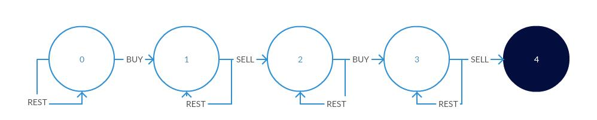

# 数学知识

* [数学原理](#数学原理)
  * [素数（质数）](#素数（质数）)
  * [求素数算法](#求素数算法)
  * [最大公约数](#最大公约数)
    * [欧几里得算法（辗转相除法）](#欧几里得算法（辗转相除法）)
    * [Stein算法](#Stein算法)
  * [最小公倍数](#最小公倍数)
  * [平方数](#平方数)
  * [剪绳子](#剪绳子)
* [进制转换](#进制转换)
  * [数字转换为十六进制数](#数字转换为十六进制数)
  * [Excel表列名称](#Excel表列名称)
* [统计个数](#统计个数)
  * [统计阶乘尾部有多少个 0](#统计阶乘尾部有多少个 0)
  * [整数中1出现的次数](#整数中1出现的次数)
  * [第N个数字](#第N个数字)
* [改变数组元素使所有的数组元素都相等](#改变数组元素使所有的数组元素都相等)
* [多数投票问题](#多数投票问题)
* [除自身以外数组的乘积](#除自身以外数组的乘积)
* [买卖股票问题](#买卖股票问题)
* [约瑟夫环](#约瑟夫环)
* [汉诺塔](#汉诺塔)
* [前缀、中缀、后缀表达式](#前缀、中缀、后缀表达式)
  + [中缀变前缀](#中缀变前缀)
  + [前缀计算机求值](#前缀计算机求值)
  + [中缀变后缀（TODO）](#中缀变后缀（TODO）)
  + [后缀计算机求值（TODO）](#后缀计算机求值（TODO）)

## 数学原理

### 素数（质数）

**每一个数都可以分解成素数的乘积**，例如

> $84 = 2^2 * 3^1 * 5^0 * 7^1 * 11^0 * 13^0 * 17^0 * …$

**如果x整除y（y mod x = 0），则对所有$i$，$m_i < n_i$。**其中，

> $x = 2^{m0} * 3^{m1} * 5^{m2} * 7^{m3} * 11^{m4} * …$
>
> $y = 2^{n0} * 3^{n1} * 5^{n2} * 7^{n3} * 11^{n4} * …$

**最大公约数（greatest common divisor）最小公倍数（least common multiple）**

> x和y的最大公约数为：$gcd(x, y) = 2^{min(m0, n0)} * 3^{min(m1, n1)} * 5^{min(m2, n2)} * ...$
>
> x和y的最小公倍数为：$lcm(x, y) = 2^{max(m0, n0)} * 3^{max(m1, n1)} * 5^{max(m3, n3)} * ...$

### 求素数算法

1. 最笨的方法

   挨个循环用n除以2到n-1之间的所有整数，如果期间有一个能被整除，那么n是合数（不是素数）。

2. 利用定理：如果一个数是合数，那么它的最小质因数肯定小于等于它的平方根。

   ```java
   public static boolean isPrime(int n) {  
       for (int i = 2; i <= Math.sqrt(n); i++) {  
           if (n % i == 0) {  
               return false;  
           }  
       }   
       return true;  
   }  
   ```

3. 筛选法求素数：在每次找到一个素数时，将能被素数整除的数排除掉。便于求i-j之间的质数。

   [统计所有小于非负整数 *n* 的质数的数量](https://leetcode.com/problems/count-primes/)

   ```java
   public int countPrimes(int n) {
   	boolean[] notPrimes = new boolean[n + 1];
       int count = 0;
       for(int i = 2; i < n; i++){
           if( notPrimes[i] ) continue;
           count ++;
           for(long j = (long) (i) * i; j < n; j += i){
               notPrimes[(int) j] = true;
           }
       }
       return count;
   }
   ```

### 最大公约数

#### 欧几里得算法（辗转相除法）

```java
int gcd(int a, int b){
    return b == 0 ? a : gcd(b, a % b);
}
```

#### Stein算法

对于 a 和 b 的最大公约数 f(a, b)，有：

- 如果 a 和 b 均为偶数，f(a, b) = 2*f(a/2, b/2);
- 如果 a 是偶数 b 是奇数，f(a, b) = f(a/2, b);
- 如果 b 是偶数 a 是奇数，f(a, b) = f(a, b/2);
- 如果 a 和 b 均为奇数，f(a, b) = f(b, a-b);

```java
public int gcd(int a, int b) {
    if (a < b) return gcd(b, a);
    if (b == 0) return a;
    boolean isAEven = isEven(a), isBEven = isEven(b);
    if (isAEven && isBEven) {
        return 2 * gcd(a >> 1, b >> 1);
    } else if (isAEven && !isBEven) {
        return gcd(a >> 1, b);
    } else if (!isAEven && isBEven) {
        return gcd(a, b >> 1);
    } else {
        return gcd(b, a - b);
        // return gcd((a+b)>>1, (a-b)>>1);
    }
}
// 利用位操作判断是否为偶数
private boolean isEven(int num){
    return num & 1 == 0;
}
```

### 最小公倍数

```java
int lcm(int a, int b){
    return a * b / gcd(a, b);
}
```

### 平方数

给定一个正整数 *num*，编写一个函数，如果 *num* 是一个完全平方数，则返回 True，否则返回 False。

平方序列：1,4,9,16,..

间隔：1,3,5,7,...

间隔为等差数列，使用这个特性可以得到从 1 开始的平方序列。

```java
public boolean isPerfectSquare(int num) {
    int subNum = 1;
    while (num > 0) {
        num -= subNum;
        subNum += 2;
    }
    return num == 0;
}
```

[**4的幂次方**](https://leetcode-cn.com/problems/power-of-four/solution/e-you-shi-yi-dao-zhuang-bi-jie-fa-de-suan-fa-ti-2/)

既要是4的幂次方，又要是2的幂次方

### 剪绳子

把一根绳子剪成多段，并且使得每段的长度乘积最大。

**解题思路**：利用**贪心算法**，本题应尽可能多剪长度为 3 的绳子，并且不允许有长度为 1 的绳子出现。如果出现了，就从已经切好长度为 3 的绳子中拿出一段与长度为 1 的绳子重新组合，把它们切成两段长度为 2 的绳子。

证明：当 n >= 5 时，3(n - 3) - n = 2n - 9 > 0，且 2(n - 2) - n = n - 4 > 0。因此在 n >= 5 的情况下，将绳子剪成一段为 2 或者 3，得到的乘积会更大。又因为 3(n - 3) - 2(n - 2) = n - 5 >= 0，所以剪成一段长度为 3 比长度为 2 得到的乘积更大。

```java
public int integerBreak(int n) {
    if (n < 2)
        return 0;
    if (n == 2)
        return 1;
    if (n == 3)
        return 2;
    int timesOf3 = n / 3;
    if (n - timesOf3 * 3 == 1)
        timesOf3--;
    int timesOf2 = (n - timesOf3 * 3) / 2;
    return (int) (Math.pow(3, timesOf3)) * (int) (Math.pow(2, timesOf2));
}
```

或利用**动态规划**

```java
public int integerBreak(int n) {
    int[] dp = new int[n + 1];
    dp[1] = 1;
    for (int i = 2; i <= n; i++)
        for (int j = 1; j < i; j++)
            dp[i] = Math.max(dp[i], Math.max(j * (i - j), dp[j] * (i - j)));
    return dp[n];
}
```

## 进制转换

### 数字转换为十六进制数

[数字转换为十六进制数](https://leetcode-cn.com/problems/convert-a-number-to-hexadecimal/)：给定一个整数，编写一个算法将这个数转换为十六进制数。对于负整数，我们通常使用 补码运算方法。

```java
public String toHex(int num) {
    char[] map = {'0', '1', '2', '3', '4', '5', '6', '7', '8', '9', 'a', 'b', 'c', 'd', 'e', 'f'};
    if (num == 0) return "0";
    StringBuilder sb = new StringBuilder();
    while (num != 0) {
        sb.append(map[num & 0b1111]);
        // 因为考虑的是补码形式，因此符号位就不能有特殊的意义，需要使用无符号右移，左边填0
        num >>>= 4; 
    }
    return sb.reverse().toString();
}
```

**补充**：

> System.out.println(0b101);	//二进制:5  （0b开头的）
>
> System.out.println(011);	//八进制:9   (0开头的)   数字零
>
> System.out.println(11);	//十进制:11
>
> System.out.println(0x11C);	//十六进制:284   （0x开头的）

### Excel表列名称

[Excel表列名称](https://leetcode-cn.com/problems/excel-sheet-column-title/)：给定一个正整数，返回它在 Excel 表中相对应的列名称。

例如，

    1 -> A
    2 -> B
    3 -> C
    ...
    26 -> Z
    27 -> AA
    28 -> AB 
    ...
示例 :

```
输入: 1,	28,	701
输出: "A",	"AB",	"ZY"
```

```java
public String convertToTitle(int n) {
    String str = "ABCDEFGHIJKLMNOPQRSTUVWXYZ";
    StringBuffer sb = new StringBuffer();
    while(n != 0){
        if(n % 26 == 0){
            sb.append("Z");
            n = n / 26 - 1;
        }else{
            sb.append(str.charAt(n % 26 - 1));
            n = n / 26;
        }
    }
    return sb.reverse().toString();
}
```

## 统计个数

### 统计阶乘尾部有多少个 0

尾部的 0 由 2 * 5 得来，2 的数量明显多于 5 的数量，因此只要统计有多少个 5 即可。

对于一个数 N，它所包含 5 的个数为：$N/5 + N/5^2 + N/5^3 + ...$，其中 N/5 表示不大于 N 的数中 5 的倍数贡献一个 5，$N/5^2$表示不大于 N 的数中 $5^2$ 的倍数再贡献一个 5 ...。**即，25贡献两个5**。

```java
public int trailingZeroes(int n) {
    return n == 0 ? 0 : n / 5 + trailingZeroes(n / 5);
}
```

**补充**：

如果统计的是 N! 的二进制表示中最低位 1 的位置，只要统计有多少个 2 即可，该题目出自编程之美：2.2。

和求解有多少个 5 一样，2 的个数为 $N/2 + N/2^2 + N/2^3 + ...$

### 整数中1出现的次数

给定n，求从1到n的整数中，1出现的次数。如1~13中包含1的数字有1、10、11、12、13，因此共出现6次。

**思路**：设N = abcde ,其中abcde分别为十进制中各位上的数字。 如果要计算百位上1出现的次数，它要受到3方面的影响：百位上的数字，百位以下（低位）的数字，百位以上（高位）的数字。

1.   如果百位上数字为0，百位上可能出现1的次数由更高位决定。比如：12013，则可以知道百位出现1的情况可能是：100-199，1100-1199, 2100-2199，，...，11100-11199，一共1200个。可以看出是由更高位数字（12）决定，并且等于更高位数字（12）乘以 当前位数（100）。 
2.  如果百位上数字为1，百位上可能出现1的次数不仅受更高位影响还受低位影响。比如：12113，则可以知道百位受高位影响出现的情况是：100-199，1100-1199,2100-2199，，....，11100-11199，一共1200个。和上面情况一样，并且等于更高位数字（12）乘以 当前位数（100）。但同时它还受低位影响，百位出现1的情况是：12100~12113,一共114个，等于低位数字（113）+1。 
3.  如果百位上数字大于1（2-9），则百位上出现1的情况仅由更高位决定，比如12213，则百位出现1的情况是：100-199, 1100-1199，2100-2199，...，11100-11199, 12100-12199，一共有1300个，并且等于更高位数字+1（12+1）乘以当前位数（100）。  

```java
public int NumberOf1Between1AndN_Solution(int n) {
    int count = 0; // 1的个数
    int i = 1; // 当前位
    int current = 0,after = 0,before = 0;
    while((n / i) != 0){           
        current = (n / i) % 10; // 当前位数字
        before = n / (i * 10); // 高位数字
        after = n - (n / i) * i; // 低位数字
        //如果为0,出现1的次数由高位决定,等于高位数字 * 当前位数
        if (current == 0)
            count += before * i;
        //如果为1,出现1的次数由高位和低位决定,高位*当前位+低位+1
        else if(current == 1)
            count += before * i + after + 1;
        //如果大于1,出现1的次数由高位决定,//（高位数字+1）* 当前位数
        else{
            count += (before + 1) * i;
        }                
        i = i * 10; //前移一位
    }
    return count;
}
```

### 第N个数字

[第N个数字](https://leetcode-cn.com/problems/nth-digit/)：在无限的整数序列 1, 2, 3, 4, 5, 6, 7, 8, 9, 10, 11, ...中找到第 *n* 个数字。*n* 是正数且在32为整形范围内 ( $n < 2^{31}$)。

```tex
输入:11		输出:0
说明:
第11个数字在序列 1, 2, 3, 4, 5, 6, 7, 8, 9, 10, 11, ... 里是0，它是10的一部分。
```

- 1-9有9个数，10-99有20X9个数字，100-999有300X9个数字，1000-9999有4000X9个数字；以此类推；
- 设置一个标志位i，每一个区间都有固定的标志位，例如1-9是1，10--99是2，以此类推；然后用n减去每个区间的值，知道确定n在哪个区间；
- 在得到区间中确定的数字，将其变为string型，然后就可以得到确定的数字。

```java
public static int findNthDigit(int n) {
    int i = 1;
    while(n > i * Math.pow(10, i-1) * 9){
        n -= i * Math.pow(10, i-1) * 9; //小于区间的值要减去，知道得到确定的区间
        i++; //标志位++；
    }
    int num = (int) ((n - 1) / i + Math.pow(10, i - 1)); //确定区间中数字；
    String a = Integer.toString(num); //将数字变为string，好取得确定的数字；
    if(n % i == 0) return a.charAt(i-1) - '0';
    return a.charAt(n % i - 1) - '0';
}
```


## 改变数组元素使所有的数组元素都相等

[最少移动次数使数组元素相等](https://leetcode-cn.com/problems/minimum-moves-to-equal-array-elements-ii/)：给定一个非空整数数组，找到使所有数组元素相等所需的最小移动数，其中每次移动可将选定的一个元素加1或减1。

```tex
Input:[1,2,3]	Output:2

Explanation:
Only two moves are needed (remember each move increments or decrements one element):
[1,2,3]  =>  [2,2,3]  =>  [2,2,2]
```

每次可以对一个数组元素加一或者减一，求最小的改变次数。

这是个典型的**相遇问题**，移动距离最小的方式是所有元素都移动到**中位数**，理由如下：

设m为中位数。a和b是m两边的两个元素，且b>a。要使a和b相等，它们总共移动次数为b-a。这个值等于$(b-x)+(x-a)$。要使总移动次数最小，必须满足x=m。即，把这两个数移动到中位数。

```java
// 先排序，在利用双指针。
// 时间复杂度为O(NlgN)。也可以利用快排降低至O(N)
public int minMoves2(int[] nums) {
    Arrays.sort(nums);
    int move = 0;
    int l = 0, h = nums.length - 1;
    while (l < h) {
        move += nums[h] - nums[l];
        l++;
        h--;
    }
    return move;
}
```

**补充**：给定一个长度为 *n* 的**非空**整数数组，找到让数组所有元素相等的最小移动次数。每次移动可以使 *n* - 1 个元素增加 1。

题意可理解位每次让一个值减去1，使得所有的值相等，那理想情况就是每个值最终等于最小值。 那么题目就转换为所有值减去最小值的和。

## 多数投票问题

[数组中出现次数多于 n / 2 的元素](https://leetcode-cn.com/problems/majority-element/)

解法1：先对数组排序，最中间那个数出现次数一定多于 n / 2。

```java
public int majorityElement(int[] nums) {
    Arrays.sort(nums);
    return nums[nums.length / 2];
}
```

解法2：利用**Boyer-Moore Majortiy Vote Algorithm**来解决这个问题，使得时间复杂度为O(N)。

```java
public int majorityElement(int[] nums) {
    int cnt = 0, majority = nums[0];
    for (int num : nums) {
        majority = (cnt == 0) ? num : majority;
        cnt = (majority == num) ? cnt + 1 : cnt - 1;
    }
    return majority;
}
```

**算法思路**：使用cnt来统计一个元素出现的次数，当遍历到的元素和统计元素不相等时，令cnt--。假设频次大于N/2的对象值为A，如果cnt等于零，则可以确定在数组已经扫描过的部分，A的出现频率少于等于1/2。（如果A或者任意其他值在已经扫描部分大于1/2，则cnt不能为0）。那么未扫描部分，则A的频率仍然是大于等于1/2，问题规模得以减小，但性质保持不变。

对于确定存在频次大于N/2的对象的情况下，算法到此结束了。
对于不能确定是否存在频次大于N/2的对象的情况下，还需要额外一次数组扫描。对其出现次数进行计数，如果大于N/2,则为结果值，否则没有频次大于N/2的对象。

**提升**：

http://liuyang1.github.io/2015/12/30/vote/

http://yelinsheng.top/post/majority-voting-algorithm/

## 除自身以外数组的乘积

[除自身以外数组的乘积](https://leetcode-cn.com/problems/product-of-array-except-self/)：给定长度为 n 的整数数组 nums，其中 n > 1，返回输出数组 output ，其中 output[i] 等于 nums 中除 nums[i] 之外其余各元素的乘积。

**示例:**

```
输入: [1,2,3,4]
输出: [24,12,8,6]
```

**说明:** 请**不要使用除法，**且在 O(*n*) 时间复杂度内完成此题。

```java
public int[] productExceptSelf(int[] nums) {
        int length = nums.length;
        int[] answer = new int[length];
        answer[0] = 1;
        for (int i = 1; i < length; i++) {
            answer[i] = nums[i - 1] * answer[i - 1];
        }
        int R = 1;
        for (int i = length - 1; i >= 0; i--) {
            answer[i] = answer[i] * R;
            R *= nums[i];
        }
        return answer;
    }
```

## 买卖股票问题

### 买卖股票的最佳时机

[买卖股票的最佳时机](https://leetcode-cn.com/problems/best-time-to-buy-and-sell-stock/)：给定一个数组，它的第 i 个元素是一支给定股票第 i 天的价格。

如果你最多只允许完成一笔交易（即买入和卖出一支股票），设计一个算法来计算你所能获取的最大利润。

注意你不能在买入股票前卖出股票。

```tex
输入: [7,1,5,3,6,4]
输出: 5
解释: 在第 2 天（股票价格 = 1）的时候买入，在第 5 天（股票价格 = 6）的时候卖出，最大利润 = 6-1 = 5 。
注意利润不能是 7-1 = 6, 因为卖出价格需要大于买入价格。

输入: [7,6,4,3,1]
输出: 0
解释: 在这种情况下, 没有交易完成, 所以最大利润为 0。
```

一次遍历：通过维持两个变量——minPrice和maxProfit，它们分别对应迄今为止所得到的最小谷值和最大的利润。

```java
public int maxProfit(int prices[]) {
    int minprice = Integer.MAX_VALUE;
    int maxprofit = 0;
    for (int i = 0; i < prices.length; i++) {
        if (prices[i] < minprice)
            minprice = prices[i];
        else if (prices[i] - minprice > maxprofit)
            maxprofit = prices[i] - minprice;
    }
    return maxprofit;
}
```

### 买卖股票的最佳时机 II

[买卖股票的最佳时机 II](https://leetcode-cn.com/problems/best-time-to-buy-and-sell-stock-ii/)：给定一个数组，它的第 i 个元素是一支给定股票第 i 天的价格。

设计一个算法来计算你所能获取的最大利润。你可以尽可能地完成更多的交易（多次买卖股票）。

注意：你不能同时参与多笔交易（你必须在再次购买前出售掉之前的股票）。

```tex
输入: [7,1,5,3,6,4]
输出: 7
解释: 在第 2 天（股票价格 = 1）的时候买入，在第 3 天（股票价格 = 5）的时候卖出, 这笔交易所能获得利润 = 5-1 = 4 。随后，在第 4 天（股票价格 = 3）的时候买入，在第 5 天（股票价格 = 6）的时候卖出, 这笔交易所能获得利润 = 6-3 = 3 。
```

```java
public int maxProfit(int[] prices) {
    int maxProfit = 0;
    for(int i = 1; i < prices.length; i++){
        if(prices[i] - prices[i-1] > 0){
            maxProfit += prices[i] - prices[i-1];
        }
    }
    return maxProfit;
}
```


### 买卖股票的最佳时机 III

[买卖股票的最佳时机 III](https://leetcode-cn.com/problems/best-time-to-buy-and-sell-stock-iii/)：给定一个数组，它的第 i 个元素是一支给定的股票在第 i 天的价格。

设计一个算法来计算你所能获取的最大利润。你最多可以完成 两笔 交易。

注意: 你不能同时参与多笔交易（你必须在再次购买前出售掉之前的股票）。

```tex
输入: [3,3,5,0,0,3,1,4]
输出: 6
解释: 在第 4 天（股票价格 = 0）的时候买入，在第 6 天（股票价格 = 3）的时候卖出，这笔交易所能获得利润 = 3-0 = 3 。随后，在第 7 天（股票价格 = 1）的时候买入，在第 8 天 （股票价格 = 4）的时候卖出，这笔交易所能获得利润 = 4-1 = 3 。
```

**状态机**：每天我们其实是有四个状态，

- 买入当前价格的股票；
- 以当前价格的股票卖出；
- 第二次买入股票；
- 第二次卖出股票。

`s0`代表初始状态，初始时钱是 `0`。`s1`代表第一次买入后当前的钱，`s2`代表第一次卖出后当前的前，`s3`代表第二次买入后当前的钱，`s4`代表第二次卖出后当前的钱。



```java
public int maxProfit(int[] prices) {
    if(prices.length == 0) return 0;
    int s1 = - prices[0];    int s2 = Integer.MIN_VALUE;
    int s3 = Integer.MIN_VALUE;    int s4 = Integer.MIN_VALUE;
    for(int i = 1; i < prices.length; i++){
        s1 = Math.max(s1, -prices[i]);
        s2 = Math.max(s2, prices[i] + s1);
        s3 = Math.max(s3, s2 - prices[i]);
        s4 = Math.max(s4, prices[i] + s3);
    }
    return Math.max(0, s4);
}
```

### 买卖股票的最佳时机 IV

[买卖股票的最佳时机 IV](https://leetcode-cn.com/problems/best-time-to-buy-and-sell-stock-iv/)：给定一个数组，它的第 i 个元素是一支给定的股票在第 i 天的价格。

设计一个算法来计算你所能获取的最大利润。你最多可以完成 k 笔交易。

```java
public int maxProfit(int max_k, int[] prices) {
    int n = prices.length;
    if(n == 0) return 0;
    if(max_k < n / 2){
        int[] cash = new int[max_k + 1];
        int[] hold = new int[max_k + 1];
        for(int i = 0; i < n; i++){
            for(int k = max_k; k >= 1; k--){
                if(i == 0){
                    cash[k] = 0;
                    hold[k] = -prices[i];
                }else{
                    cash[k] = Math.max(cash[k], hold[k] + prices[i]);
                    hold[k] = Math.max(hold[k], cash[k - 1] - prices[i]);
                }
            }
        }
        return cash[max_k];
    }else{
        int cash = 0, hold = Integer.MIN_VALUE;
        for(int i = 0; i < n; i++){
            int temp = cash;
            cash = Math.max(cash, hold + prices[i]);
            hold = Math.max(hold, cash - prices[i]);
        }
        return cash;
    }
}
```

### 买卖股票的最佳时机含手续费

[买卖股票的最佳时机含手续费](https://leetcode-cn.com/problems/best-time-to-buy-and-sell-stock-with-transaction-fee/)：给定一个整数数组 prices，其中第 i 个元素代表了第 i 天的股票价格 ；非负整数 fee 代表了交易股票的手续费用。

你可以无限次地完成交易，但是你每次交易都需要付手续费。如果你已经购买了一个股票，在卖出它之前你就不能再继续购买股票了。返回获得利润的最大值。

```tex
输入: prices = [1, 3, 2, 8, 4, 9], fee = 2
输出: 8
解释: 能够达到的最大利润:  
在此处买入 prices[0] = 1
在此处卖出 prices[3] = 8
在此处买入 prices[4] = 4
在此处卖出 prices[5] = 9
总利润: ((8 - 1) - 2) + ((9 - 4) - 2) = 8.
```

**动态规划**：通过维护两个变量cash和hold，

- cash：不持有股票时的最大利润；
- hold：当我们持有股票时的最大利润。

在第$i$天时，我们需要根据$i-1$天的状态来更新cash和hold的值。

- 对于cash，我们可以保持不变，或者以此时的价格将手上的股票卖出：

  `cash = Math.max(cash, hold + prices[i] - fee);`

- 对于hold，我们可以保持不变（继续持有），或者买入这一天的股票：

  `hold = Math.max(hold, cash - prices[i]);`

在计算这两个状态转移方程时，我们可以不使用临时变量来存储$i-1$天的cash和hold值，而是可以通过**先计算cash再计算hold**，原因在于**同一天卖出再买入（亏了一笔手续费）一定不会比不进行任何操作好**。

```java
public int maxProfit(int[] prices, int fee) {
    int cash = 0, hold = -prices[0];
    for(int i = 1; i < prices.length; i++){
        cash = Math.max(cash, hold + prices[i] - fee);
        hold = Math.max(hold, cash - prices[i]);
    }
    return cash;
}
```

### 最佳买卖股票时机含冷冻期

[最佳买卖股票时机含冷冻期](https://leetcode-cn.com/problems/best-time-to-buy-and-sell-stock-with-cooldown/)：给定一个整数数组，其中第 i 个元素代表了第 i 天的股票价格 。

设计一个算法计算出最大利润。在满足以下约束条件下，你可以尽可能地完成更多的交易（多次买卖一支股票）:

- 你不能同时参与多笔交易（你必须在再次购买前出售掉之前的股票）。
- 卖出股票后，你无法在第二天买入股票 (即冷冻期为 1 天)。

```tex
输入: [1,2,3,0,2]
输出: 3 
解释: 对应的交易状态为: [买入, 卖出, 冷冻期, 买入, 卖出]
```

```java
public int maxProfit(int[] prices) {
    int cash = 0, hold = Integer.MIN_VALUE;
    int cold = 0; // 记录前一天的cash
    for(int i = 0; i < prices.length; i++){
        int temp = cash;
        cash = Math.max(cash, hold + prices[i]);
        hold = Math.max(hold, cold - prices[i]); // 不能立马卖
        cold = temp;
    }
    return cash;
}
```

## 约瑟夫环

 Josephus有过的故事：39 个犹太人与Josephus及他的朋友躲到一个洞中，39个犹太人决定宁愿死也不要被敌人抓。于是决定了自杀方式，41个人排成一个圆圈，由第1个人开始报数，每报数到第3人该人就必须自杀。然后下一个重新报数，直到所有人都自杀身亡为止。然而Josephus 和他的朋友并不想遵从，Josephus要他的朋友先假装遵从，他将朋友与自己安排在第16个与第31个位置，于是逃过了这场死亡游戏。
**公式**：（人数编号从0开始，与数组下标一致）
$$
\begin{align}
f(1) = & \ 0;\quad(i = 1) \\
f(i) = & \ (f(n-1) + m) \ \% \ i; \quad (i > 1)
\end{align}
$$
[剑指offer](https://www.nowcoder.com/practice/f78a359491e64a50bce2d89cff857eb6?tpId=13&tqId=11199&tPage=3&rp=3&ru=/ta/coding-interviews&qru=/ta/coding-interviews/question-ranking)

[参考链接](https://blog.csdn.net/OKasy/article/details/79503398)

## 汉诺塔

有三根杆子A，B，C。A杆上有 N 个 (N>1) 穿孔圆盘，盘的尺寸由下到上依次变小。要求按下列规则将所有圆盘移至 C 杆：

1. 每次只能移动一个圆盘；
2. 大盘不能叠在小盘上面。

提示：可将圆盘临时置于 B 杆，也可将从 A 杆移出的圆盘重新移回 A 杆，但都必须遵循上述两条规则。

问：如何移？最少要移动多少次？

```java
private static int count = 0; // 移动次数
// 递归实现哈诺塔问题
public static void hanoi(int n, char a, char b, char c) {
    if(n == 0) return;
    hanoi(n - 1, a, c , b);
    System.out.println("第" + ++count + "次移动：把" + n + "号盘从" + a + "移动到" + c);
    hanoi(n - 1, b, a, c);
}
```

## 前缀、中缀、后缀表达式

[前缀、中缀、后缀表达式](https://blog.csdn.net/Antineutrino/article/details/6763722)：它们都是对表达式的记法，区别在于运算符相对于操作数的位置。

```tex
中缀表达式	(3 + 4) × 5 - 6
前缀表达式	× + 3 4 5 6
后缀表达式	3 4 + 5 × 6 -
```

### 中缀变前缀

1. 初始化两个栈：**运算符栈**S1和**中间结果栈**S2；
2. 从**右到左**扫描中缀表达式；
3. 遇到操作数，将其压入S2；
4. 遇到运算符，比较其与S1栈顶运算符的优先级；
   1. 如果S1为空，或栈顶元素为右括号”）“，则直接入栈；
   2. 否则，若优先级**高于或等于**栈顶元素，也直接入栈；
   3. 否则，将S1栈顶的运算符弹出并压入S2中，再次转到（4-1）与S1中新的栈顶元素比较；
5. 遇到括号时：
   1. 如果是右括号“）”，直接压入S1中；
   2. 如果是左括号“（”，则依次弹出S1栈顶元素，并压入S2中，直到遇到右括号位置，此时将这一对括号丢弃；
6. 重复步骤（2）至（5），直到表达式的最左边；
7. 将S1中剩余的元素依次弹出并压入S2；
8. 依次弹出S2中的元素并输出，结果即为对应的前缀表达式。

例如，将中缀表达式“1+((2+3)×4)-5”转换为前缀表达式的过程如下：

| 扫描到的元素 | S2(栈底->栈顶)    | S1 (栈底->栈顶) | 说明                             |
| ------------ | ----------------- | --------------- | -------------------------------- |
| 5            | 5                 | 空              | 数字，直接入栈                   |
| -            | 5                 | -               | S1为空，运算符直接入栈           |
| )            | 5                 | - )             | 右括号直接入栈                   |
| 4            | 5 4               | - )             | 数字直接入栈                     |
| ×            | 5 4               | - ) ×           | S1栈顶是右括号，直接入栈         |
| )            | 5 4               | - ) × )         | 右括号直接入栈                   |
| 3            | 5 4 3             | - ) × )         | 数字                             |
| +            | 5 4 3             | - ) × ) +       | S1栈顶是右括号，直接入栈         |
| 2            | 5 4 3 2           | - ) × ) +       | 数字                             |
| (            | 5 4 3 2 +         | - ) ×           | 左括号，弹出运算符直至遇到右括号 |
| (            | 5 4 3 2 + ×       | -               | 同上                             |
| +            | 5 4 3 2 + ×       | - +             | 优先级与-相同，入栈              |
| 1            | 5 4 3 2 + × 1     | - +             | 数字                             |
| 到达最左端   | 5 4 3 2 + × 1 + - | 空              | S1中剩余的运算符                 |

因此结果为“- + 1 × + 2 3 4 5”。
### 前缀计算机求值

从**右至左扫描**表达式，遇到数字时，将数字压入堆栈，遇到运算符时，弹出栈顶的两个数，用运算符对它们做相应的计算（栈顶元素 op 次顶元素），并将结果入栈；重复上述过程直至表达式的最左端，最后运算得出的值即为表达式的结果。

例如，上述前缀表达式“- + 1 × + 2 3 4 5”。

1. 从右至左扫描，将5、4、3、2入栈；
2. 遇到+运算符，因此弹出2和3，计算2+3，并将结果5入栈；
3. 接下里是x运算符，因此弹出5和4，计算结果20入栈；
4. 1入栈；
5. 弹出1和20，计算1+20=21入栈；
6. 最后是-运算，计算出21-5 = 16。由此也得出最终结果。

可以看出，计算机计算前缀表达式的值是很容易的。

TODO

### 中缀变后缀（TODO）


### 后缀计算机求值（TODO）

