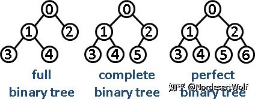
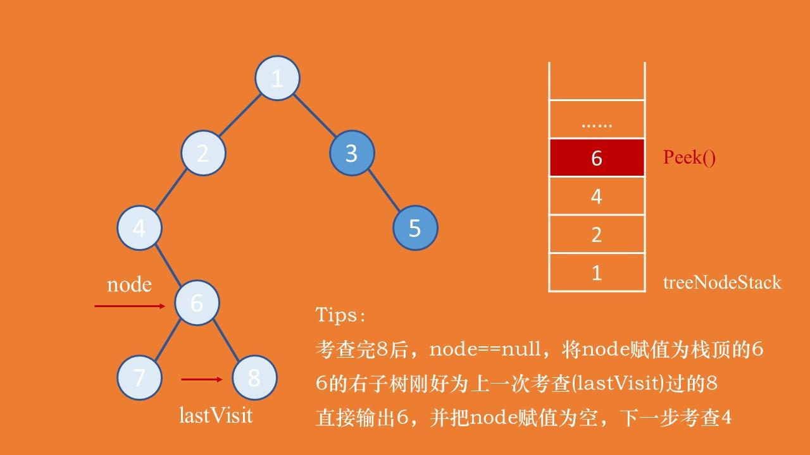

# 数据结构--树

- [树的实现](#树的实现)
- [一些常见的树](#一些常见的树)
  - [满二叉树](#满二叉树)
  - [完全二叉树](#完全二叉树)
  - [完美二叉树](#完美二叉树)
  - [二叉查找树](#二叉查找树)
  - [红黑树](#红黑树)
  - [Trie树](#Trie树)
- [DFS、BFS](#DFS、BFS)
- [先序、中序、后序遍历](#先序、中序、后序遍历)
  - [递归实现遍历](#递归实现遍历)
  - [迭代实现遍历](#迭代实现遍历)

- [经典例题](#经典例题)
  - [递归](#递归)
    - [二叉树的深度](#二叉树的深度)
    - [修剪二叉搜索树](#修剪二叉搜索树)
    - [二叉搜索树中第K小的元素](#二叉搜索树中第K小的元素)
    - [判断是否为平衡二叉树](#判断是否为平衡二叉树)
    - [相同节点值的最大路径长度](#相同节点值的最大路径长度)
    - [把二叉搜索树转换为累加树](#把二叉搜索树转换为累加树)
  - [层次遍历](#层次遍历)
    - [找树左下角的值](#找树左下角的值)
    - [二叉树的层平均值](#二叉树的层平均值)
  - [其他](#其他)
    - [翻转二叉树](#翻转二叉树)

## 树的实现

```java
class TreeNode {
    int val;
    TreeNode left;
    TreeNode right;

    TreeNode(int x) {
        val = x;
    }
}
```

## 一些常见的树

### 满二叉树

- **国内定义**：一个二叉树，每一层的结点数都达到最大值。也就是说，如果一个二叉树的层数为k，且结点总数为$2^k-1$，则它就是满二叉树（Full Binary Tree）。
- **国外定义**：如果一个二叉树的结点要么是叶子结点，要么它有两个子结点，这样的树就是满二叉树。

**国内外定义有歧义**。国内做法：

- 在国际交流场合，包括学术会议发表论文等都应该使用国际定义；
- 在国内的各种考试场合，如研究生考试、软考，使用国内教程的定义。

### 完全二叉树

Complete Binary Tree，除了最后一层之外的其他每一层都被完全填充，并且所有结点都保持向左对齐。

### 完美二叉树

Perfect Binary Tree，除了叶子结点之外的每一个结点都有两个孩子，每一层(当然包含最后一层)都被完全填充。



总结：中国定义的满二叉树就是国际定义的完美二叉树。

### 二叉查找树

Binary Search Tree，也称为**[二叉搜索树](https://zh.wikipedia.org/wiki/%E4%BA%8C%E5%85%83%E6%90%9C%E5%B0%8B%E6%A8%B9)**，是指一棵空树或者具有以下性质的树：

1. 若任意节点的左子树不空，则左子树所有节点的值小于它根节点的值；
2. 若任意节点的右子树不空，则右子树上所有节点的值均大于它的根节点的值；
3. 任意节点的左、右子树也分别为二叉查找树；
4. 没有键值相等的节点。

二叉查找树**中序遍历**结果**有序**。

### 红黑树

[红黑树](https://zhuanlan.zhihu.com/p/31805309)，Red-black Tree，是一种自平衡二叉查找树，典型的用途是**关联数组**。在二叉查找树强制的一般要求外，对于任何有效的红黑树，我们增加了如下额外的要求：

- 节点是红色或黑色
- 根是黑色
- 所有叶子都是黑色（叶子是NIL节点（空节点））
- 每个红色节点必须有两个黑色的子节点
- 从任一节点到其每个叶子的所有简单路劲都要包含相同数目的黑色节点。


### Trie树

trie，又称前缀树或字典树，是一种有序树，用于保存**关联数组**，其中的键通常是字符串。

在计算机科学中，关联数组（英语：Associative Array），又称映射（Map）、字典（Dictionary）是一个抽象的数据结构，它包含着类似于（键，值）的有序对。

题1：[实现一个 Trie (前缀树)](https://leetcode-cn.com/problems/implement-trie-prefix-tree/)，包含 insert, search, 和 startsWith 这三个操作。

```java
class TrieNode {

    private TrieNode[] links; // 指向子节点

    private final int R = 26; // 26个英文字母

    private boolean isEnd = false; // 是否为结束标志

    // 构造方法，创建一个包含26个字母的一层节点
    public TrieNode() {
        links = new TrieNode[R]; // [0-25]==a-z
    }
    
    // 该层trie树是否包含字符ch
    public boolean containsKey(char ch) {
        return links[ch - 'a'] != null;
    }

    // 得到包含ch的树
    public TrieNode get(char ch) {
        return links[ch - 'a'];
    }

    // 将字符ch放入到trie中
    public void put(char ch, TrieNode node) {
        links[ch - 'a'] = node;
    }

    // 设置为结束标志
    public void setEnd() {
        isEnd = true;
    }

    // 判断是否为结束标志
    public boolean isEnd() {
        return isEnd;
    }

}
// 实现trie的插入、查找等常见功能 https://leetcode.com/articles/implement-trie-prefix-tree/
class Trie {

    private TrieNode root;

    public Trie() {
        root = new TrieNode();
    }

    // insert a word into the Trie
    public void insert(String word) {
        TrieNode node = root;
        for (int i = 0; i < word.length(); i++) {
            char currentChar = word.charAt(i);
            if( !node.containsKey(currentChar) ) {
                node.put(currentChar, new TrieNode());
            }
            node = node.get(currentChar);
        }
        node.setEnd();
    }

    public TrieNode searchPrefix(String word) {
        TrieNode node = root;
        for (int i = 0; i < word.length(); i++) {
            char currentChar = word.charAt(i);
            if (node.containsKey(currentChar)) {
                node = node.get(currentChar);
            } else {
                return null;
            }
        }
        return node;
    }

    public boolean search(String word) {
        TrieNode node = searchPrefix(word);
        return node != null && node.isEnd();
    }

    public boolean startsWith(String prefix) {
        TrieNode node = searchPrefix(prefix);
        return node != null;
    }
}
```

本质上，trie树是一个关联数组，下述用简单粗暴的方式阐述。

```java
// 利用简单的关联数组实现Trie树
class TrieNode {
    TrieNode[] links = new TrieNode[26];
    boolean isleaf  = false;
}

class Trie {

    TrieNode root;

    Trie() {
        root = new TrieNode();
    }

    // 实现插入方法
    public void insert(String word) {
        insert(word, root);
    }

    public void insert(String word, TrieNode node) {
        if (node == null) {
            return;
        }
        if (word.length() == 0) {
            node.isleaf = true;
            return;
        }
        int index = word.charAt(0) - 'a';
        if (node.links[index] == null) {
            node.links[index] = new TrieNode();
        }
        insert(word.substring(1), node.links[index]);
    }

    // 实现 查找 功能
    public boolean search(String word) {
        return search(word, root);
    }

    private boolean search(String word, TrieNode node) {
        if (node == null) {
            return false;
        }
        if (word.length() == 0) return node.isleaf;
        int index = word.charAt(0) - 'a';
        return search(word.substring(1), node.links[index]);
    }

    /** Returns if there is any word in the trie that starts with the given prefix. */
    public boolean startsWith(String prefix) {
        return startsWith(prefix, root);
    }

    private boolean startsWith(String prefix, TrieNode node) {
        if (node == null) {
            return false;
        }
        if (prefix.length() == 0) return true;
        int index = prefix.charAt(0) - 'a';
        return startsWith(prefix.substring(1), node.links[index]);
    }
}
```

题2：[键值映射](https://leetcode-cn.com/problems/map-sum-pairs/)

```java
class TrieNode {
    TrieNode[] links = new TrieNode[26]; 
    int val;
}

class MapSum {

    private TrieNode root;

    public MapSum() {
        root = new TrieNode();
    }

    public void insert(String key, int val) {
        insert(key, val, root);
    }

    private void insert(String key, int val, TrieNode node) {
        if (node == null) {
            return;
        }
        if (key.length() == 0) {
            node.val = val;
            return;
        }
        int index = key.charAt(0) - 'a';
        if (node.links[index] == null) {
            node.links[index] = new TrieNode();
        }
        insert(key.substring(1), val, node.links[index]);
    }
    
    public int sum(String prefix) {
        return sum(prefix, root);
    }

    private int sum(String prefix, TrieNode node) {
        if (node == null) {
            return 0;
        }
        if (prefix.length() != 0) {
            int index = prefix.charAt(0) - 'a';
            return sum(prefix.substring(1), node.links[index]);
        }
        int sum = node.val;
        for (TrieNode child : node.links) {
            sum += sum(prefix, child);
        }
        return sum;
    }
}
```

## DFS、BFS

[参考链接DFS](https://zh.wikipedia.org/wiki/%E6%B7%B1%E5%BA%A6%E4%BC%98%E5%85%88%E6%90%9C%E7%B4%A2)；[参考链接BFS](https://zh.wikipedia.org/wiki/%E5%B9%BF%E5%BA%A6%E4%BC%98%E5%85%88%E6%90%9C%E7%B4%A2)

**深度优先搜索算法**（英语：Depth-First-Search，DFS）。沿着树的深度遍历树的节点，尽可能深的搜索树的分支。当节点v的所在边都己被探寻过，搜索将回溯到发现节点v的那条边的起始节点。

**广度优先搜索算法**（英语：Breadth-First-Search，缩写为BFS）。简单的说，BFS是从根节点开始，沿着树的宽度遍历树的节点。如果所有节点均被访问，则算法中止。

## 先序、中序、后序遍历

[参考链接](https://www.jianshu.com/p/456af5480cee)

前序、中序、后序遍历利用 DFS 实现。

先序：考察到一个节点后，即刻输出该节点的值，并继续遍历其左右子树。(根左右)
中序：考察到一个节点后，将其暂存，遍历完左子树后，再输出该节点的值，然后遍历右子树。(左根右)
后序：考察到一个节点后，将其暂存，遍历完左右子树后，再输出该节点的值。(左右根)
Tips：无论先序、中序、后序，对节点的考查（不一定输出）顺序都是一样的。


### 递归实现遍历

仅输出节点顺序不同

```java
public static void recursionTravesal(TreeNode root) {
    if (root != null) {
        // System.out.println(root.val); // 先序遍历
        recursionTravesal(root.left);
        // System.out.println(root.val); // 中序遍历
        recursionTravesal(root.right);
        System.out.println(root.val); // 后序遍历
    }
}
```

### 迭代实现遍历

迭代遍历时，因为需要在遍历完节点的左子树时接着遍历节点的右子树，为了能找到该节点，需要使用**栈**来进行暂存。先序、中序与后序都涉及到了**回溯**，因此都需要栈。

1. 先序遍历（遍历过程见注释）

   ```java
   public void preorderTraversal(TreeNode root) {
           Stack<TreeNode> stack = new Stack<TreeNode>(); // 用来暂存节点
           TreeNode curNode = root;
       	// 当且仅当，该节点的左右子树为空（此时该节点已输出），且栈也为空，结束循环
           while (curNode != null || !stack.isEmpty()) { 
               // 若当前考查节点非空，则输出该节点的值
               while (curNode != null) {
                   System.out.println(curNode.val); // 先序遍历
                   stack.add(curNode);
                   curNode = curNode.left;
               }
               // 一直到左子树为空，开始考查右子树
               curNode = stack.pop().right; // 弹出栈顶元素，将游标等于该节点的右子树
           }
       }
   ```

2. 中序遍历

   ```java
   public List<Integer> inorderTraversal(TreeNode root) {
       List<Integer> ret = new ArrayList<Integer>();
       Stack<TreeNode> stack = new Stack<TreeNode>();// 后进先出
       TreeNode curNode = root;
       while (curNode != null || !stack.empty()) {
           while (curNode != null) {
               stack.add(curNode);
               curNode = curNode.left;
           }
           curNode = stack.pop();
           ret.add(curNode.val); // 中序遍历
           curNode = curNode.right;
       }
       return ret;
   }
   ```

3. 后序遍历

   后序遍历与先序、中序遍历不一样之处在于，后序遍历在输出该节点值时，需要考虑其左右之树是否已经遍历完成。

   所以需要设置一个lastVisit游标，当lastVisit等于当前考查节点的右子树，表示该节点的左右子树都已经遍历完成，可以输出当前节点值。

   

   ```java
   public List<Integer> postorderTraversal(TreeNode root) {
       List<Integer> ret = new ArrayList<Integer>();
       Stack<TreeNode> stack = new Stack<TreeNode>();
       TreeNode curNode = root;
       TreeNode lastVisit = root;
       while (curNode != null || !stack.empty()) {
           while (curNode != null) {
               stack.add(curNode);
               curNode = curNode.left;
           }
           curNode = stack.peek(); // 后续遍历
           // 如果右子树为空或者已经访问，即可输出当前节点值
           if (curNode.right == null || curNode == lastVisit) {
               ret.add(curNode.val);
               stack.pop(); // 此时，才可删除元素
               lastVisit = curNode; // 更新lastVisit，回到上一层时才回用到
               curNode = null; // 需将curNode设为空，下一轮即可访问栈顶元素
           } else { // 否则，继续遍历右节点
               curNode = curNode.right;
           }
       }
       return ret;
   }
   ```


## 经典例题

### 递归

一棵树要么是空树，要么有两个指针，每个指针指向一棵树。树是一种递归结构，很多树的问题可以使用递归来处理。

#### 二叉树的深度

[二叉树的深度](https://leetcode-cn.com/problems/maximum-depth-of-binary-tree/)。二叉树的深度为根节点到最远叶子节点的最长路径上的节点数。

```java
public int maxDepth(TreeNode root) {
    if (root == null) return 0;
    return Math.max(maxDepth(root.left), maxDepth(root.right)) + 1;
}
```

#### 修剪二叉搜索树

[修剪二叉搜索树](https://leetcode-cn.com/problems/trim-a-binary-search-tree/)。通过修剪二叉搜索树，使得所有节点的值在`[L, R]`中 (R>=L) 。你可能需要改变树的根节点，所以结果应当返回修剪好的二叉搜索树的新的根节点。

```java
public TreeNode trimBST(TreeNode root, int L, int R) {
    if(root == null) return null;
    if(root.val < L) return trimBST(root.right, L, R);
    if(root.val > R) return trimBST(root.left, L, R);
    root.left = trimBST(root.left, L, R);
    root.right = trimBST(root.right, L, R);
    return root;
}
```

#### 二叉搜索树中第K小的元素

[二叉搜索树中第K小的元素](https://leetcode-cn.com/problems/kth-smallest-element-in-a-bst/)。给定一个二叉搜索树，查找其中第 **k** 个最小的元素。

方法1：**根据节点的个数求解**

```java
public int kthSmallest(TreeNode root, int k) {
    int cnt = count(root.left);
    if(cnt == k-1) return root.val;
    else if(cnt > k-1) return kthSmallest(root.left, k);
    else return kthSmallest(root.right, k-cnt-1);
}
// 统计树的节点个数
private int count(TreeNode node) {
    if(node == null) return 0;
    return 1 + count(node.left) + count(node.right);
}
```

给定一棵二叉搜索树，请找出其中的第k小的结点。例如， （5，3，7，2，4，6，8）    中，按结点数值大小顺序第三小结点的值为4。

方法2：**根据中序遍历求解**：二叉搜索树按照中序遍历的顺序打印出来正好就是排序好的顺序。所以，按照中序遍历顺序找到第k个结点就是结果。

方法2-1：**递归解法**

```java
private int index = 0;
TreeNode KthNode(TreeNode root, int k){
    if(root != null){
        TreeNode cur = KthNode(root.left, k);
        if(cur != null)	return cur; // 左子树中找到符合要求的节点返回
        index ++;
        if(index == k)	return root; // 从最左节点开始，count+1；
        cur = KthNode(root.right, k);
        if(cur != null)	return cur; //左子树没找到，在右子树找到了符合要求的节点返回
    }
    return null;
}
```

方法2-2：**迭代解法**

```java
TreeNode KthNode(TreeNode root, int k){
    if(root == null || k <= 0) return null;
    Stack<TreeNode> stack = new Stack<TreeNode>();
    while(root != null || !stack.isEmpty()){
        while(root != null){
            stack.push(root);
            root = root.left;
        }
        TreeNode cur = stack.pop();
        k--;
        if(k == 0)	return cur;
        root = cur.right;
    }
    return null;
}
```

#### 判断是否为平衡二叉树

给定一个二叉树，判断它是否是[平衡二叉树](https://leetcode-cn.com/problems/balanced-binary-tree/)。

一个二叉树每个节点的左右两个子树的高度差的绝对值不超过1。

```java
boolean flag = true;

public boolean IsBalanced_Solution(TreeNode root) {
    depth(root);
    return flag;
}

public int depth(TreeNode root){
    if(root == null) return 0;
    int left = depth(root.left);
    int right = depth(root.right);
    if(Math.abs(left - right) > 1) flag = false;
    return Math.max(left, right) + 1;
}
```

#### 相同节点值的最大路径长度

[相同节点值的最大路径长度](https://leetcode-cn.com/problems/longest-univalue-path/)。给定一个二叉树，找到最长的路径，这个路径中的每个节点具有相同值。 这条路径可以经过也可以不经过根节点。

```java
private int path = 0;

public int longestUnivaluePath(TreeNode root) {
    dfs(root);
    return path;
}

private int dfs(TreeNode root){
    if (root == null) return 0;
    int left = dfs(root.left);
    int right = dfs(root.right);
    int leftPath = root.left != null && root.left.val == root.val ? left + 1 : 0;
    int rightPath = root.right != null && root.right.val == root.val ? right + 1 : 0;
    path = Math.max(path, leftPath + rightPath);
    return Math.max(leftPath, rightPath);
}
```

#### 把二叉搜索树转换为累加树

[把二叉搜索树转换为累加树](https://leetcode-cn.com/problems/convert-bst-to-greater-tree/)。给定一个二叉搜索树（Binary Search Tree），把它转换成为累加树（Greater Tree)，使得每个节点的值是原来的节点值加上所有大于它的节点值之和。

```java
private int sum = 0;
public TreeNode convertBST(TreeNode root) {
    rightSum(root);
    return root;
}
// 从最右侧开始对每个节点的值进行求和
private void rightSum(TreeNode node) {
    if(node == null) return;
    rightSum(node.right);
    sum += node.val;
    node.val = sum;
    rightSum(node.left);
}
```

### 层次遍历

利用**BFS**实现层次遍历。不需要使用两个队列来分别存储当前层的节点和下一层的节点。利用开始遍历时，队列中的节点数保证当前层的节点数。

#### 找树左下角的值

[找树左下角的值](https://leetcode-cn.com/problems/find-bottom-left-tree-value/)。给定一个二叉树，在树的最后一行找到最左边的值。

```java
public int findBottomLeftValue(TreeNode root) {
    Queue<TreeNode> queue = new LinkedList<>();
    queue.add(root);
    while (!queue.isEmpty()) {
        root = queue.poll();
        if (root.right != null) queue.add(root.right);
        if (root.left != null) queue.add(root.left);
    }
    return root.val;
}
```

#### 二叉树的层平均值

[二叉树的层平均值](https://leetcode-cn.com/problems/average-of-levels-in-binary-tree/)。给定一个非空二叉树, 返回一个由每层节点平均值组成的数组.

```java
public List<Double> averageOfLevels(TreeNode root) {
    List<Double> ret = new ArrayList<>();
    Queue<TreeNode> queue = new LinkedList<>();
    queue.add(root);
    while (!queue.isEmpty()) {
        int cnt = queue.size();
        double sum = 0;
        for (int i = 0; i < cnt; i++) {
            TreeNode node = queue.poll();
            sum += node.val;
            if (node.left != null) queue.add(node.left);
            if (node.right != null) queue.add(node.right);
        }
        ret.add(sum / cnt);
    }
    return ret;
}
```

### 其他

#### 翻转二叉树