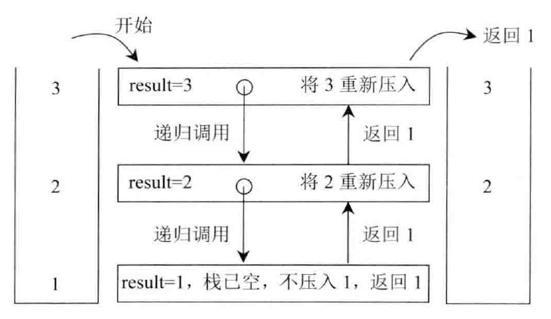
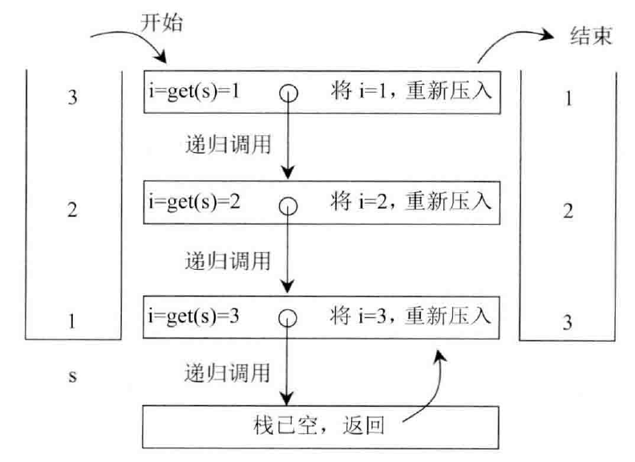

# Java集合

- [基本类型](#List、Set、Map)
  - [List](#List)
  - [Set](#Set)
  - [Map](#Map)
- [Java集合类](#Collections与Arrays)
- [栈和队列](#栈和队列)
  - [利用递归函数逆序栈](#利用递归函数逆序栈)
- [优先级队列](#优先级队列)
  - [有序矩阵中第K小的元素](#有序矩阵中第K小的元素)
- [经典例题](#经典例题)
  - [散列表](#散列表)
    - [存在重复元素](#存在重复元素)
    - [存在重复元素 II](#存在重复元素 II)
    - [最长连续序列](#最长连续序列)
    - [两数之和](#两数之和)
    - [最长和谐数组](#最长和谐数组)
  - [栈和队列](#栈和队列)
    - [利用栈来实现队列](#利用栈来实现队列)
    - [利用队列来实现栈](#利用队列来实现栈)
    - [利用栈记录遍历过的数组元素](#利用栈记录遍历过的数组元素)

## List、Set、Map

List：存储一组不唯一、有序的对象；

Set：不允许重复的结合。无序（插入顺序）。

Map：使用键值对存储。两个key可以引用相同的对象，但是key不能重复。

### List

典型集合**ArrayList**与**LinkedList**的区别：

- 都是线程不同步，也就是线程不安全的。
- 底层数据结构。ArrayList是Object数组；LinkedList的双向链表（JDK1.6之前为循环链表）。
- 由于底层数据结构的不同，ArrayList支持随机访问（RandomAccess），但插入和删除（指定位置）的时间复杂度受元素位置的影响。LinkedList则相反。
- 内存空间占用。ArrayList的空间浪费主要体现在，list列表的结尾会预留一定的容量；ArrayList主要体现在每一个元素都要消耗比ArrayList更多的空间（存放后继和前驱指针）。

快速随机访问就是可以通过元素的序号获取元素的对象（对应`get(int index)`方法）。

**遍历方式的选取：**

- 实现了RandomAccess接口的List（ArrayList），优先选择普通for循环，其次foreach。
- 未实现RandomAccess接口的List（LinkedList），优先选择iterator（foreach底层也是通过iterator实现，大size的数据，千万别使用for i循环）。

**Vector**是**线程同步**的ArrayList。

**这里补充一点比较重要，但是容易被忽视掉的知识点：**

- Java中的 `length `属性是针对数组说的,比如说你声明了一个数组,想知道这个数组的长度则用到了 length 这个属性.
- Java中的 `length()` 方法是针对字符串说的,如果想看这个字符串的长度则用到 `length()` 这个方法.
- Java中的 `size()` 方法是针对泛型集合说的,如果想看这个泛型有多少个元素,就调用此方法来查看!

### Set

**HashSet**（无序、唯一）：基于HashMap实现，底层采用HashMap来保存元素。

**TreeSet**（有序、唯一）：红黑树（自平衡的排序二叉树）。

**HashSet如何判断重复**：首先判断hashcode，再判断equals方法。

**hashCode（）与equals（）的相关规定：**

1. 如果两个对象相等，则hashcode一定也是相同的
2. 两个对象相等,对两个equals方法返回true
3. 两个对象有相同的hashcode值，它们也不一定是相等的
4. 综上，equals方法被覆盖过，则hashCode方法也必须被覆盖
5. hashCode()的默认行为是对堆上的对象产生独特值。如果没有重写hashCode()，则该class的两个对象无论如何都不会相等（即使这两个对象指向相同的数据）。

**==与equals的区别**

1. ==是判断两个变量或实例是不是指向同一个内存空间， equals是判断两个变量或实例所指向的内存空间的值是不是相同
2. ==是指对内存地址进行比较 ，equals()是对字符串的内容进行比较
3. ==指引用是否相同， equals()指的是值是否相同

### Map

**HashMap**：JDK1.8之前HashMap是由数组+链表组成的，数组是HashMap的主体，链表则是为了解决哈希冲突而存在的（“拉链法”解决冲突）。JDK1.8以后再解决哈希冲突时有了较大的变化，当链表长度大于阈值（默认为8）时，将链表转化为红黑树，以减少搜索时间。

所谓 **“拉链法”** 就是：将链表和数组相结合。也就是说创建一个链表数组，数组中每一格就是一个链表。若遇到哈希冲突，则将冲突的值加到链表中即可。

**TreeMap**：红黑树（自平衡的排序二叉树）。

TreeMap能够把它保存的记录根据键排序，默认是按键值的升序排序，也可以指定排序的比较器。当使用Iterator遍历TreeMap时，得到的记录是排过序的。在使用TreeMap时，key必须实现Comparable接口，或者在构造TreeMap时传入自定义的Comparator，否则在运行时抛出ClassCastException类型的异常。

## Collections与Arrays

Collections是一个操作集合的工具类，常用方法有：

```java
// 对list集合排序
sort(list);
sort(list,comparator)；
// 对list进行二分查找，二分查找必须集合有序
int binarySearch(list,key);
int binarySearch(list,key,Comparator);
// 最大值、最小值
T max(list);
T min(list);
// 对list集合进行反转
reverse(list);    
```

Arrays是操作数组对象的工具类。

常用方法有：

- *二分查找*
- *数组排序*
- *将数组变成集合asList*
- *将数组变成字符串toString*
- *复制数组copyOf*
- *复制部分数组copyOfRange*
- *比较两个数组是否相同equals*

## 栈和队列

在Java语言中，栈使用`java.util.Stack`，队列使用`java.util.LinkedList`

```java
import java.util.LinkedList;
import java.util.Queue;
import java.util.Stack;

Stack<T> stack = new Stack<>(); // 栈
Queue<T> queue = new LinkedList<>(); // 队列
```

栈和队列的常用方法：

```java
public static void testStack(){
    Stack<Integer> stack = new Stack<>();
    Queue<Integer> queue = new LinkedList<>();
    stack.add(1); stack.push(2); // 添加元素
    queue.add(1); queue.offer(2);
    stack.isEmpty(); queue.isEmpty(); // 判空
    stack.pop(); queue.poll(); // 取出栈顶元素
    stack.peek(); queue.peek(); // 查看栈顶元素
    stack.size(); queue.size(); // 查看元素个数
}
```

### 利用递归函数逆序栈

实现栈中元素逆序，但是只能用递归函数来实现，不能使用其他数据结构。

本题考查栈的操作和递归函数的设计，我们需要设计两个递归函数。

1. 递归函数1：**将栈stack的栈底元素返回并移除**；

```java
public int getAndRemoveLastElement(Stack<Integer> stack){
    int result = stack.pop();
    if(stack.isEmpty()){
		return result;
    }else{
        int last = getAndRemoveLastElement(stack);
        stack.push(result);
        return last;
    }
}
```

2. 递归函数2：reverse方法。利用上述getAndRemoveLastElement方法。

```java
public static void reverse(Stack<Integer> stack){
    if(stack.isEmpty()){
        return;
    }
    int i = getAndRemoveLastElement(stack);
    reverse(stack);
    stack.push(i);
}
```

<center class="half">


</center>

## 优先级队列

[参考链接](https://my.oschina.net/leejun2005/blog/135085)

PriorityQueue是一种基于**优先级堆**的极大优先级队列。

优先级队列是不同于先进先出队列的另一种队列。每次从队列中取出的是具有最高优先权的元素。（必须以队列的方式取元素，poll()）

如果不提供Comparator的话，优先级队列元素默认按自然顺序排列，也就是数字默认是小的在队列头，字符串则按字典序排列。

优先级队列不允许null元素，同时也不允许插入不可比较的对象（导致ClassCastException）。

**注意：**

- 优先级队列是用数组实现，数组大小可以动态增加，容量无限。
- 此实现是不同步的，是线程不安全的。PriorityBlockingQueue是线程安全的。
- 方法iterator()中提供的迭代器**并不保证**以有序的方式遍历优先级队列中的元素。**原因可参考大顶堆、小顶堆的内部实现。**
- 此类实现了Collection和Iterator接口的所有可选方法。

```java
// 未指定Comparator，按插入元素自然顺序排序
public static void testPriorityQueue() {
    PriorityQueue<Integer> pq = new PriorityQueue<>();
    pq.add(1);pq.add(2);pq.add(4);pq.add(3);
    while (!pq.isEmpty()) {
        System.out.print(pq.poll()+"\t"); // 1	2	3	4
    }
}

// 指定Comparator
public static void testPriorityQueue2() {
    // 利用匿名内部内指定Comparator
    PriorityQueue<Integer> pq = new PriorityQueue<>(new Comparator<Integer>(){
        @Override
        public int compare(Integer o1, Integer o2) {
            return o2.compareTo(o1);
        }
    });
    pq.add(1);pq.add(2);pq.add(4);pq.add(3);
    while (!pq.isEmpty()) {
        System.out.print(pq.poll()+"\t"); // 4	3	2	1
    }
}
```

### 有序矩阵中第K小的元素

[有序矩阵中第K小的元素](https://leetcode-cn.com/problems/kth-smallest-element-in-a-sorted-matrix/)：给定一个 *n x n* 矩阵，其中每行和每列元素均按升序排序，找到矩阵中第k小的元素。请注意，它是排序后的第k小元素，而不是第k个元素。

示例:

```
matrix = [
   [ 1,  5,  9],
   [10, 11, 13],
   [12, 13, 15]
],
k = 8,
返回 13。
```

```java
class Solution {
    public int kthSmallest(int[][] matrix, int k) {
        PriorityQueue<Trupe> pq = new PriorityQueue<>();
        int col = matrix.length, row = matrix[0].length;
        for (int i = 0; i < row; i++) {
            pq.offer(new Trupe(0, i, matrix[0][i]));
        }
        for (int i = 0; i < k - 1; i++) {
            Trupe del = pq.poll();
            if (del.x == col - 1) continue;
            pq.offer(new Trupe(del.x + 1, del.y, matrix[del.x + 1][del.y]));
        }
        return pq.peek().val;
    }

    class Trupe implements Comparable<Trupe>{
        int x, y, val;
        Trupe(int x, int y, int val){
            this.x = x; this.y = y; this.val = val;
        }
        @Override
        public int compareTo(Trupe that) {
            return this.val - that.val;
        }
    }
}
```

## 经典例题

### 散列表

散列表（Hash table，也叫哈希表），是根据键（Key）而直接访问在内存存储位置的数据结构。也就是说，它通过计算一个关于键值的函数，将所需查询的数据映射到表中一个位置来访问记录，这加快了查找速度。这个映射函数称做散列函数，存放记录的数组称做散列表。

#### 存在重复元素

[存在重复元素](https://leetcode-cn.com/problems/contains-duplicate/)：给定一个整数数组，判断是否存在重复元素。

如果任何值在数组中出现至少两次，函数返回 true。如果数组中每个元素都不相同，则返回 false。

```java
public boolean containsDuplicate(int[] nums) {
    Set<Integer> set = new HashSet<>();
    for (int num : nums) {
        set.add(num);
    }
    return set.size() < nums.length;
}
```

#### 存在重复元素 II

[存在重复元素 II](https://leetcode-cn.com/problems/contains-duplicate-ii/)：给定一个整数数组和一个整数 k，判断数组中是否存在两个不同的索引 i 和 j，使得 nums [i] = nums [j]，并且 i 和 j 的差的绝对值最大为 k。

[思路](https://leetcode-cn.com/problems/contains-duplicate-ii/solution/cun-zai-zhong-fu-yuan-su-ii-by-leetcode/)：注意，此题如果利用自平衡的二叉搜索树（红黑树）TreeSet，会超时。

因为，此题要进行n次搜索、删除、插入操作。TreeSet每次耗费对数时间，即为$log(min(k,n))$；而散列表的搜索、删除与插入的操作时间都是常数时间。

```java
public boolean containsNearbyDuplicate(int[] nums, int k) {
    Set<Integer> set = new HashSet<>();
    for(int i = 0; i < nums.length; i++){
        if(set.contains(nums[i])) return true;
        set.add(nums[i]);
        if(set.size() > k){
            set.remove(nums[i-k]);
        }
    }
    return false;
}
```

#### 最长连续序列

[最长连续序列](https://leetcode-cn.com/problems/longest-consecutive-sequence/)：给定一个未排序的整数数组，找出最长连续序列的长度。要求算法的时间复杂度为 *O(n)*。

**示例:**

```
输入: [100, 4, 200, 1, 3, 2]
输出: 4
解释: 最长连续序列是 [1, 2, 3, 4]。它的长度为 4。
```

```java
// https://leetcode.com/problems/longest-consecutive-sequence/
public int longestConsecutive(int[] nums) {
    Set<Integer> num_set = new HashSet<Integer>();
    for (int num : nums) {
        num_set.add(num);
    }
    int longestStreak = 0;
    for (int num : num_set) {
        if (!num_set.contains(num - 1)) {
            int currentNum = num;
            int currentStreak = 1;

            while (num_set.contains(currentNum + 1)) {
                currentNum += 1;
                currentStreak += 1;
            }

            longestStreak = Math.max(longestStreak, currentStreak);
        }
    }
    return longestStreak;
}
```

#### 两数之和

[两数之和](https://leetcode-cn.com/problems/two-sum/)：给定一个整数数组 `nums` 和一个目标值 `target`，请你在该数组中找出和为目标值的那两个整数，并返回他们的数组下标。

**示例:**

```
给定 nums = [2, 7, 11, 15], target = 9

因为 nums[0] + nums[1] = 2 + 7 = 9
所以返回 [0, 1]
```

Java中的HashMap主要用于映射关系，从而把两个元素联系起来。HashMap也可以用来对元素进行计数统计，此时键为元素，值为计数。

```java
public int[] twoSum(int[] nums, int target) {
    HashMap<Integer, Integer> indexForNum = new HashMap<>();
    for (int i = 0; i < nums.length; i++) {
        if (indexForNum.containsKey(target - nums[i])) {
            return new int[]{indexForNum.get(target - nums[i]), i};
        } else {
            indexForNum.put(nums[i], i);
        }
    }
    return null;
}
```

#### 最长和谐数组

和谐数组是指一个数组里元素的最大值和最小值之间的差别正好是1。

现在，给定一个整数数组，你需要在所有可能的子序列中找到最长的和谐子序列数组的长度。

**示例 1:**

```
输入: [1,3,2,2,5,2,3,7]
输出: 5
原因: 最长的和谐数组是：[3,2,2,2,3].
```

```java
public int findLHS(int[] nums) {
    HashMap < Integer, Integer > map = new HashMap < > ();
    int res = 0;
    for (int num: nums) {
        map.put(num, map.getOrDefault(num, 0) + 1);
        if (map.containsKey(num + 1))
            res = Math.max(res, map.get(num) + map.get(num + 1));
        if (map.containsKey(num - 1))
            res = Math.max(res, map.get(num) + map.get(num - 1));
    }
    return res;
}
```

### 栈和队列

#### 利用栈来实现队列

栈的顺序为后进先出，而队列的顺序为先进先出。使用两个栈实现队列，一个元素需要经过两个栈才能出队列，在经过第一个栈时元素顺序被反转，经过第二个栈时再次被反转，此时就是先进先出顺序。

```java
class MyQueue {
    
    private Stack<Integer> in;
    private Stack<Integer> out;
    /** Initialize your data structure here. */
    public MyQueue() {
        in = new Stack<Integer>();
        out = new Stack<Integer>();
    }
    
    /** Push element x to the back of queue. */
    public void push(int x) {
        in.push(x);
    }
    
    /** if out is empty, add in's item to out*/
    private void in2out(){
        if(out.isEmpty()){
            while(!in.isEmpty()){
                out.push(in.pop());
            }
        }
    }
    
    /** Removes the element from in front of queue and returns that element. */
    public int pop() {
        in2out();
        return out.pop();
    }
    
    /** Get the front element. */
    public int peek() {
        in2out();
        return out.peek();
    }
    
    /** Returns whether the queue is empty. */
    public boolean empty() {
        return in.isEmpty() && out.isEmpty();
    }
}

/**
 * Your MyQueue object will be instantiated and called as such:
 * MyQueue obj = new MyQueue();
 * obj.push(x);
 * int param_2 = obj.pop();
 * int param_3 = obj.peek();
 * boolean param_4 = obj.empty();
 */
```

#### 利用队列来实现栈

在将一个元素 x 插入队列时，为了维护原来的后进先出顺序，需要让 x 插入队列首部。而队列的默认插入顺序是队列尾部，因此在将 x 插入队列尾部之后，需要让除了 x 之外的所有元素出队列，再入队列。

```java
class MyStack {
	
    Queue<Integer> queue;
    /** Initialize your data structure here. */
    public MyStack() {
        queue = new LinkedList();
    }
    
    /** Push element x onto stack. */
    public void push(int x) {
        queue.add(x); // attention, queue no push method 
        int cnt = queue.size();
        while(cnt-- > 1){
            queue.add(queue.poll());
        }
    }
    
    /** Removes the element on top of the stack and returns that element. */
    public int pop() {
        return queue.poll();
    }
    
    /** Get the top element. */
    public int top() {
        return queue.peek();
    }
    
    /** Returns whether the stack is empty. */
    public boolean empty() {
        return queue.isEmpty();
    }
}
```

#### 利用栈记录遍历过的数组元素

注意：后续是利用while循环遍历堆栈中元素

```java
// https://leetcode.com/problems/daily-temperatures/
public int[] dailyTemperatures(int[] T) {
    int len = T.length;
    int[] ret = new int[len];
    Stack<Integer> stack = new Stack<>();
    for (int curIndex = 0; curIndex < len; curIndex++) {
        while (!stack.isEmpty() && T[curIndex] > T[stack.peek()]) {
            int preIndex = stack.pop();
            ret[preIndex] = curIndex - preIndex;
        }
        stack.push(curIndex);
    }
    return ret;
}
```

```java
// https://leetcode.com/problems/next-greater-element-ii
public int[] nextGreaterElements(int[] nums) {
    int len = nums.length;
    int[] ret = new int[len];
    Arrays.fill(ret, -1);
    Stack<Integer> stack = new Stack<>();
    for (int i = 0; i < len*2; i++) {
        int num = nums[i % len];
        while(!stack.isEmpty() && num > nums[stack.peek()]){
            ret[stack.pop()] = num;
        }
        if(i < len) stack.push(i);
    }
    return ret;
}
```

