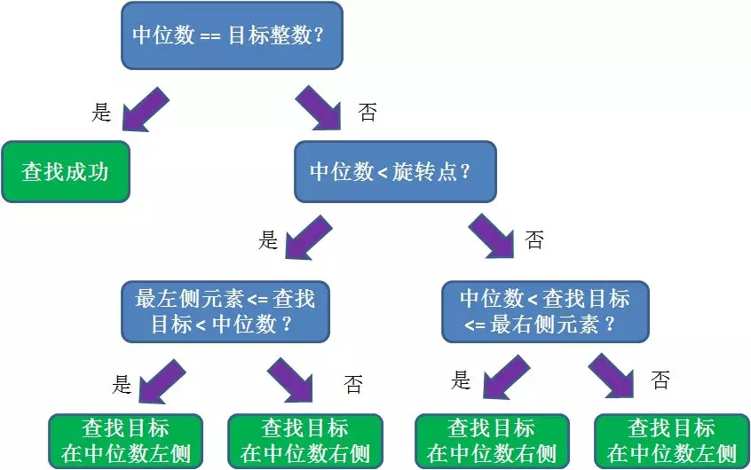

# 二分查找

> Although the basic idea of binary search is comparatively straightforward, the details can be surprisingly tricky...

二分查找，也称为折半查找。每次查找都将查找区间减半，因此时间复杂度为$O(logn)$

1. 查找**区间有序**

2. 防止**加法溢出**，也就是说加法的结果大于整型能够表示的范围。

   > mid = (right + left) / 2; 这种情况可能出现加法溢出，即 和超出int范围。
   >
   > 应使用 **mid = left + (right - left) / 2**
   >
   > 当然，除以2可以用右移一位代替，也是官方推荐：**mid = left + (right - left) >> 2**

3. **使用else if**。不要出现else，而是把所有情况用else if写清楚，这样可以清楚地展现所有细节。

## 基本框架

```java
int binarySearch(int[] nums, int target) {
    int left = 0, right = ...;
    
    while(...) {
        int mid = (right + left) / 2;
        if (nums[mid] == target) {
            ...
        } else if (nums[mid] < target) {
            left = ...
        } else if (nums[mid] > target) {
            right = ...
        }
    }
    return ...;
}
```

## 基本的二分查找

这个场景是最简答的。即，搜索一个数，如果存在，返回其索引；否则，返回$-1$.

```java
public static int binarySearch(int[] arr, int key) {
    int left = 0, mid = 0, right = arr.length - 1;
    while(left <= right){
        mid = (right + left) / 2;
        if(arr[mid] == key) return mid;
        else if(arr[mid] < key) left = mid + 1;
        else if(arr[mid] > key) right = mid - 1;
    }
	return -1;
    //return left; 待插入位置
}
```

## 寻找左侧边界

```java
int left_bound(int[] nums, int target) {
    if (nums.length == 0) return -1;
    int left = 0;
    int right = nums.length; // 注意

    while (left < right) { // 注意
        int mid = left + ((right - left) >> 1);
        if (nums[mid] == target) {
            right = mid;
        } else if (nums[mid] < target) {
            left = mid + 1;
        } else if (nums[mid] > target) {
            right = mid; // 注意
        }
    }
    return left;
}
```

1. 为什么 while(left < right) 而不是 <= ?

   > 答：用相同的方法分析，因为初始化 right = nums.length 而不是 nums.length - 1 。因此每次循环的**「搜索区间」**是 [left, right) 左闭右开。while(left < right) 终止的条件是 left == right，此时搜索区间 [left, left) 恰巧为空，所以可以正确终止。

2. 为什么没有返回 -1 的操作？如果 nums 中不存在 target 这个值，怎么办？

   > 答：函数的返回值（即 left 变量的值）取值区间是闭区间，[0, nums.length]。
   >
   > 所以我们简单添加两行代码就能在正确的时候 return -1：
   >
   > `// target 比所有数都大`
   > `if (left == nums.length) return -1;`
   > `// 其它情况，包括 left = 0`
   > `return nums[left] == target ? left : -1;`

3. 为什么 left = mid + 1，right = mid ？和之前的算法不一样？

   > 答：这个很好解释，因为我们的「搜索区间」是 [left, right) 左闭右开，所以当 nums[mid] 被检测之后，下一步的搜索区间应该去掉 mid 分割成两个区间，即 [left, mid) 或 [mid + 1, right)。

4. 为什么该算法能够搜索左侧边界？

   > 答：关键在于对于 nums[mid] == target 这种情况的处理：
   >
   > ​	`if (nums[mid] == target) right = mid`
   >
   > 可见，找到 target 时不要立即返回，而是缩小「搜索区间」的上界 right，在区间 [left, mid) 中继续搜索，即不断向左收缩，达到锁定左侧边界的目的。

5. 为什么返回 left 而不是 right？

   > 答：都是一样的，因为 while 终止的条件是 left == right。

## 寻找右侧边界

```java
int right_bound(int[] nums, int target) {
    if (nums.length == 0) return -1;
    int left = 0, right = nums.length;

    while (left < right) {
        int mid = left + (right - left) / 2;;
        if (nums[mid] == target) {
            left = mid + 1; // 注意
        } else if (nums[mid] < target) {
            left = mid + 1;
        } else if (nums[mid] > target) {
            right = mid;
        }
    }
    return left - 1; // 注意
}
```

1. 为什么这个算法能够找到右侧边界？

   > 类似地，关键点还是这里：`if (nums[mid] == target)  left = mid + 1;`当 nums[mid] == target 时，不要立即返回，而是增大「搜索区间」的下界 left，使得区间不断向右收缩，达到锁定右侧边界的目的。

2. 为什么最后返回 left - 1 而不像左边界返回 left ？而且这里既然搜索右侧边界，应该返回 right 才对。

   > 首先，while 循环的终止条件是 left == right，所以 left 和 right 是一样的，你非要体现右侧的特点，返回 right - 1 好了。
   >
   > 因为我们对 left 的更新必须是 left = mid + 1，就是说 while 循环结束时，nums[left] 一定不等于 target 了，而 nums[left - 1] 可能是 target。

3. 为什么没有返回 -1 的操作？如果 nums 中不存在 target 这个值，怎么办？

   > 答：类似之前的左侧边界搜索，因为 while 的终止条件是 left == right，就是说 left 的取值范围是 [0, nums.length]，所以可以添加两行代码，正确地返回 -1：
   >
   >  `// target比所有数小`
   >
   > `if (left == 0) return -1;` 
   >
   > `// 其它情况，包括target比所有数大；由于取left - 1，所有可以综合考虑`
   >
   > `return nums[left-1] == target ? (left-1) : -1;`

## 总结

若想了解上述三个算法，最核心的思想是必须记住**「搜索区间」**。

第一个，最基本的二分查找算法：

> 因为我们初始化 right = nums.length - 1
> 所以决定了我们的「搜索区间」是 [left, right]
> 所以决定了 while (left <= right)
> 同时也决定了 left = mid+1 和 right = mid-1
>
> 因为我们只需找到一个 target 的索引即可
> 所以当 nums[mid] == target 时可以立即返回  

第二个，寻找左侧边界的二分查找：

> 因为我们初始化 right = nums.length
> 所以决定了我们的「搜索区间」是 [left, right)
> 所以决定了 while (left < right)
> 同时也决定了 left = mid+1 和 right = mid
>
> 因为我们需找到 target 的最左侧索引
> 所以当 nums[mid] == target 时不要立即返回
> 而要收紧右侧边界以锁定左侧边界

第三个，寻找右侧边界的二分查找：

> 因为我们初始化 right = nums.length
> 所以决定了我们的「搜索区间」是 [left, right)
> 所以决定了 while (left < right)
> 同时也决定了 left = mid+1 和 right = mid
>
> 因为我们需找到 target 的最右侧索引
> 所以当 nums[mid] == target 时不要立即返回
> 而要收紧左侧边界以锁定右侧边界
>
> 又因为收紧左侧边界时必须 left = mid + 1
> 所以最后无论返回 left 还是 right，必须减一

## LeetCode题解

### [x 的平方根](https://leetcode-cn.com/problems/sqrtx/)

计算并返回 *x* 的平方根，其中 *x* 是非负整数。结果只保留整数的部分。

```java
public int mySqrt(int x) {
    if(x<=1) return x;
    int l = 1, m = 1, h = x;
    int sqrt = 0; // 不要用乘法，用除法
    while (l <= h) {
        m = l + (h-l) / 2;
        sqrt = x / m;
        if(sqrt == x) return m;
        else if(sqrt > m) h = m - 1;
        else if(sqrt < m) l = m + 1;
    }
    return h;
}
```

### [有序数组中的单一元素](https://leetcode-cn.com/problems/single-element-in-a-sorted-array/)

给定一个只包含整数的有序数组，每个元素都会出现两次，唯有一个数只会出现一次，找出这个数。

**思路**：

要求以 O(logN) 时间复杂度进行求解，因此不能遍历数组并进行异或操作来求解，这么做的时间复杂度为 O(N)。

令 index 为 Single Element 在数组中的位置。在 index 之后，数组中原来存在的成对状态被改变。如果 m 为偶数，并且 m + 1 < index，那么 nums[m] == nums[m + 1]；m + 1 >= index，那么 nums[m] != nums[m + 1]。

从上面的规律可以知道，如果 nums[m] == nums[m + 1]，那么 index 所在的数组位置为 [m + 2, h]，此时令 l = m + 2；如果 nums[m] != nums[m + 1]，那么 index 所在的数组位置为 [l, m]，此时令 h = m。

<font color=Crimson>***因为 h 的赋值表达式为 h = m，那么循环条件也就只能使用 l < h 这种形式。***</font>

```java
public int singleNonDuplicate(int[] nums) {
    int l = 0, h = nums.length - 1;
    while (l < h) {
        int m = l + (h - l) / 2;
        if (m % 2 == 1) {
            m--;   // 保证 l/h/m 都在偶数位，使得查找区间大小一直都是奇数
        }
        if (nums[m] == nums[m + 1]) {
            l = m + 2;
        } else {
            h = m;
        }
    }
    return nums[l];
}
```

## 剑指Offer

### 旋转数组的最小数字

**题目描述**：把一个数组最开始的若干个元素搬到数组的末尾，我们称之为数组的旋转。 输入一个非减排序的数组的一个旋转，输出旋转数组的最小元素。 例如数组{3,4,5,1,2}为{1,2,3,4,5}的一个旋转，该数组的最小值为1。 NOTE：给出的所有元素都大于0，若数组大小为0，请返回0。

此时问题的关键在于确定对半分得到的两个数组哪一个是旋转数组，哪一个是非递减数组。我们很容易知道非递减数组的第一个元素一定小于等于最后一个元素。

通过修改二分查找算法进行求解（l 代表 low，m 代表 mid，h 代表 high）：

- 当 nums[m] <= nums[h] 时，表示 [m, h] 区间内的数组是非递减数组，[l, m] 区间内的数组是旋转数组，此时令 h = m；
- 否则 [m + 1, h] 区间内的数组是旋转数组，令 l = m + 1。

```java
public int minNumberInRotateArray(int[] nums) {
    if (nums.length == 0)
        return 0;
    int l = 0, h = nums.length - 1;
    while (l < h) {
        int m = l + (h - l) / 2;
        if (nums[m] <= nums[h])
            h = m;
        else
            l = m + 1;
    }
    return nums[l];
}
```

**解释**：为什么上述代码中l<h能够成功呢？个人解释如下：如果区间是左闭右闭时，而while条件为l<h时，确实有一个值没有参与if条件判断。但是，某种意义上，我们已经默认这个l，或者h角标的数就是我们要的答案。

**扩展1**：如果数组元素允许重复，会出现一个特殊的情况：nums[l] == nums[m] == nums[h]，此时无法确定解在哪个区间，需要切换到顺序查找。例如对于数组 {1,1,1,0,1}，l、m 和 h 指向的数都为 1，此时无法知道最小数字 0 在哪个区间。

```java
public int minNumberInRotateArray(int[] nums) {
    if (nums.length == 0)
        return 0;
    int l = 0, h = nums.length - 1;
    while (l < h) {
        int m = l + (h - l) / 2;
        if (nums[l] == nums[m] && nums[m] == nums[h])
            return minNumber(nums, l, h);
        else if (nums[m] <= nums[h])
            h = m;
        else
            l = m + 1;
    }
    return nums[l];
}
```

**扩展2**：[在一个旋转有序数组中，如何查找一个整数呢？](https://mp.weixin.qq.com/s?__biz=MzIxMjE5MTE1Nw==&mid=2653198327&idx=1&sn=74187f72a03db8fcad3c234d61c7bad7&chksm=8c99e52dbbee6c3b1e35ea8b2a8d57fa9fa72c098fa91e9f76a3228596922ef062fbf6f3e103&mpshare=1&scene=24&srcid=&key=8095bafaf3e0360ff8c483252809c708471b25b3132dfca15fc4fa317ce5a66a56b291e0765ef078fc6867cb252f15403be711523cc6f76c4529ff5f1a814dcd04e7e9b7b46de0bf232957784929fb2e&ascene=14&uin=Nzg0MDI3NjA3&devicetype=Windows+7&version=62060833&lang=zh_CN&pass_ticket=UCWR8ioDtSHS%2BoL3Soe2IMjeckYJhDTfT4OLISM%2Bbekc4zA7JbB3bv2fNQXx173b)注意这里有一个前提：**我们并不直接知道给定数组的旋转点。**



```java
public static int rotatedBinarySearch(int[] array, int target){
    int start = 0, end = array.length - 1;
    while(start <= end){
        int mid = start + (end - start) / 2;
        if(array[mid] == target) return mid;
        // 情况1：中位数位于旋转点左侧
        if(array[mid] >= array[start]){
            // 最左侧元素 <= 查找目标 < 中位数
            if(array[start] <= target && target < array[mid]){
                end = mid - 1;
            }else{ // 中位数 < 查找目标(查找目标位于中位数右侧)
                start = mid + 1;
            }
        }else{ // 情况2：中位数位于旋转点右侧，或与旋转点重合
            // 中位数 < 查找目标 <= 最右侧元素
            if(array[mid] < target && target <= array[end]){
                start = mid + 1;
            }else{ // 查找目标 > 中位数（查找目标位于中位数左侧）
                end = mid - 1;
            }
        }
    }
    return -1;
}
```

## [二分查找补充说明](https://leetcode-cn.com/problems/search-insert-position/solution/te-bie-hao-yong-de-er-fen-cha-fa-fa-mo-ban-python-/)

