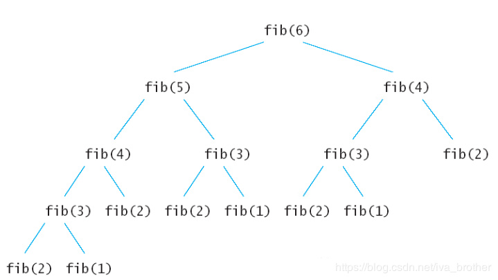
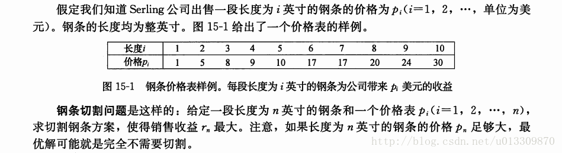

[TOC]

# 动态规划（Dynamic Programming）

大事化小，小事化了！！！！！！！！


## 基本概念

动态规划过程是：每次决策依赖于当前状态，又随即引起状态的转移。一个决策序列就是在变化的状态中产生出来的，所以，这种**多阶段最优化决策解决问题**的过程就称为动态规划。

## 基本思想与策略

 基本思想与分治法类似，也是将待求解的问题分解为若干个子问题（阶段），按顺序求解子阶段，前一子问题的解，为后一子问题的求解提供了有用的信息。在求解任一子问题时，列出各种可能的局部解，通过决策保留那些有可能达到最优的局部解，丢弃其他局部解。依次解决各子问题，最后一个子问题就是初始问题的解。

由于动态规划解决的问题多数有重叠子问题这个特点，为减少重复计算，对每一个子问题只解一次，将其不同阶段的不同状态保存在一个二维数组中。

与分治法最大的差别是：**适合于用动态规划法求解的问题，经分解后得到的子问题往往不是互相独立的（即下一个子阶段的求解是建立在上一个子阶段的解的基础上，进行进一步的求解）**。

## 适用的情况

能采用动态规划求解的问题的一般要具有3个性质：

1. **最优化原理**：如果问题的最优解所包含的子问题的解也是最优的，就称该问题具有最优子结构，即满足最优化原理。
2. **无后效性**：即某阶段状态一旦确定，就不受这个状态以后决策的影响。也就是说，某状态以后的过程不会影响以前的状态，只与当前状态有关。
3. **有重叠子问题**：即子问题之间是不独立的，一个子问题在下一阶段决策中可能被多次使用到。（*该性质并不是动态规划适用的必要条件，但是如果没有这条性质，动态规划算法同其他算法相比就不具备优势*）。

## 求解的基本步骤

动态规划所处理的问题是一个多阶段决策问题，一般由初始状态开始，通过对中间阶段决策的选择，达到结束状态。这些决策形成了一个决策序列，同时确定了完成整个过程的一条活动路线(通常是求最优的活动路线)。如下所示。动态规划的设计都有着一定的模式，一般要经历以下几个步骤。

> 初始状态→│决策１│→│决策２│→…→│决策ｎ│→结束状态

1. **划分阶段**。按照问题的时间或者空间特征，把问题分为若干个阶段。在划分阶段时，注意*划分后的阶段一定是要有序的或者是可排序的*，否则问题就无法求解。
2. **确定状态和状态变量**。将问题发展到各个阶段是所处于各种客观情况用不同的状态表示出来。当然，状态的选择要满足无后效性。
3. **确定决策并写出状态转移方程**。因为决策和状态转移有着天然的联系，*状态转移就是根据上一阶段的状态和决策来导出本阶段的状态*。所以如果确定了决策，状态转移方程也就可写出。但事实上，常常是发过来的，*根据相邻两个阶段的状态之间的关系来确定决策方法和状态转移方程*。
4. **寻找边界条件**。给出的状态转移方程是一个递归式，需要一个地推的终止条件和边界条件。

一般，只要解决问题的**划分阶段**、**状态**和**状态转移策略**，就可以写出**状态转移方法（包括边界条件）**。

实际应用中，还可以按以下几个简化的步骤进行设计：

1. 分析最优解的性质，并刻画出其结构特征。
2. 递归的定义最优解。
3. 以自底向上或自顶向下的记忆化方法计算出最优值。
4. 根据计算最优值时得到的信息，构造问题的最优解。

## 算法实现的说明

动态规划主要难点在于理论上的设计，也就是上面四个步骤的确定，一旦设计完成，实现部分就会非常加单。

使用动态规划求解问题，**最重要就是确定动态规划三要素**：

1. 问题的阶段
2. 每个阶段的状态
3. 从前一个阶段转化到后一个阶段之间的递推关系。

递推关系必须是从次小问题开始到较大问题之间的转化，从这个角度来说，动态规划往往可以用递归程序来实现。不过因为，**递推可以充分利用前面保存的子问题的解来减少重复计算，所以对于大规模问题来说，有递归不可比拟的优势，这也是动态规划算法的核心之处**。

确定了动态规划的这三要素，**整个求解过程可以用一个最优决策表来描述，最优决策是一个二维表，其中行表示决策的阶段，列表示问题状态**，表格需要**填写的数据一般对应此问题的某个阶段某个状态的最优值**（如最短路劲、最长公共子序列，最大价值等），填表的过程就是根据递推关系，从一行一列开始，以行或者列优先的顺序，依次填写表格，最后根据整个表格的数据通过简单的取舍或者运算得到问题的最优解。

## 经典试题

### 斐波拉切数列

题目描述如下：

> Fibonacci (n) = 0;   n = 0
>
> *Fibonacci (n) = 1;   n = 1, 2* 
>
> Fibonacci (n) = Fibonacci(n-1) + Fibonacci(n-2)

#### 递归解法

可读性最好，但是很多节点被重复执行，空间开销太大

```java
public static int fib(int num) {
    if(n <=  0)
        return 0;
    if(n == 1)
        return 1;
    return fib(n - 1) + fib(n - 2);
}
```



下面看看算法的执行流程，假如输入6，那么执行的递归树如下所示。上面的每个节点都会被执行一次，导致同样的节点被重复的执行，比如fib(2)被执行了5次。这样导致时间上的浪费，如果递归调用也会导致空间的浪费，导致栈溢出的问题。

结合斐波拉契数列递归解法这个案例，我们再来说说什么是动态规划。动态规划和分治法看起来是非常像的思想，但两者的区别也是非常明显的。

分治法是将问题划分为互不相交的子问题，递归求解子问题，再将他们的解组合起来，求出原问题的解。而动态规划是应用于子问题重叠的情况，即不同的子问题具有公共的子子问题。例如上述的斐波拉切数列。上述的递归解法就是分治算法，由于它的子问题是相互相关的，此时利用分治法就做了许多重复的工作，他会反复求解那些公共子子问题。而动态规划算法对每一个子子问题的解只求一次，将其保存在一个表格中，从而避免重复计算。

#### 动态规划解法

利用**动态规划**的两种方法解决斐波拉契数列问题。

在动态规划中，包含了三个重要概念：**最优子结构、边界和状态转移方程**。对于斐波拉切数列来说，fib(10)的最优子结构就是fib(9, nums) 和fib(8, nums)；边界是 nums[2] 和 nums[1]；状态转移方程是nums[10] = fibDP(9, nums) + fibDP(8, nums)。

注意最优子结构和状态转移方程的区别，个人理解就是最优子结构是针对某个值来说的，而状态转移方程就是它的整体推算方程。

##### 自顶向下（备忘录法）

**方法1：自顶向下记录已求解的节点信息**

```java
public static int fib(int num) {
    if(num <= 0) return 0;
    int[] nums = new int[num + 1]; // 这里长度为 num + 1
    Arrays.fill(nums, -1); // 利用-1填充数组
    return fibDP[num, nums]
}
// 自顶向下解法
public static int fibDP(int num, int[] nums) {
    //注意if判断的顺序
    if (nums[num] != -1) return nums[num]; // 不为-1，表示已求解
    if(num == 0) nums[num] = 0;
    else if(num == 1) nums[num] = 1;       
    else nums[num] = fibDP(num-1, nums) + fibDP(num-2, nums);
    return nums[num];
}
```

下述算法中，利用数组来存放斐波拉切数列中的每一个值，由于是自顶向下递归，它还是最先递归到nums[3]，从此刻开始在往上计算，然后依次保存计算结果在nums数组中，避免了重复运算。

##### 自底向上

**方法2：自底向上求解，并记录节点信息**

```java
public static int fibDP(int num) {
    if(num <= 0) return 0;
    int[] nums = new int[num+1];
    nums[0] = 0;
    nums[1] = 1;
    for (int i = 2; i <= num; i++) {
        nums[i] = nums[i-1] + nums[i-2];
    }
    return nums[num];
}
```

从上面的例子可以看到自顶向下的方式的动态规划其实包含了递归，而递归就会有额外的开销的；而使用**自底向上**的方式可以避免。但是该方法对于空间还是有一定的浪费，下面，我们对其空间再压缩一点。

思路：仔细观察斐波拉切数列发现，自底向上方法始终只有三个变量，n-2, n-1, n.

```java
public static int fibDP2(int num) {
    if(num <= 0) return num;
    int ret = 1; // n
    int num_1 = 1; // n - 1
    int num_2 = 0; // n - 2
    for (int i = 2; i <= num; i++) {
        ret = num_1 + num_2; // F(n) = F(n-1) + F(n-2)
        num_2 = num_1; // 更新变量 n - 2，使其等于 n - 1
        num_1 = ret; // 更新变量 n - 1，使其等于 n
    }
    return ret;
}
```

斐波拉切数列拓展例题：有一座高度是**10**级台阶的楼梯，从下往上走，每跨一步只能向上**1**级或者**2**级台阶。要求用程序来求出一共有多少种走法。（分析一下，其实就是斐波拉契数列！）

总结：至此，斐波拉切数列案列结束。不过这类案列仅仅是动态规划领域中的最最简单的问题。因为它只有一个变化维度。还有许多问题远比这复杂的多。下面敬请看入门案例2和3。弄懂这3个案列，才算对动态规划有了粗浅入门。

### 钢条切割



解法思路：

一般滴，对于$r_n(n>=1)$，我们可以用更短的钢条的最优切割收益来描述它：
$$
r_n = \max(p_n, r_1+r_{n-1},r_2+r_{n-2},...,r_{n-1}+r_1) \tag{1}
$$
第一个参数$p_n$对应不切割，直接出售长度为$n$英寸的钢条的方案。其他$n-1$个参数对应另外$n-1$种方案：对每个$i=1,2,...,n-1$，首先将钢条切割为长度为$i$和$n-i$的两段，接着求解这两段的最优切割收益$r_i$和$r_{n-i}$（每种方案的最优收益为两段的最优收益之和）。由于无法预知哪种方案会获得最优利益，我们必须考察所有可能的$i$，选取其中收益最大者。

除了上述求解方法外，钢条切割问题还存在一种相似的但更为简单的递归求解方法：我们将钢条从左边切割下长度为$i$的一段，只对右边剩下的长度为$n-i$的一段进行切割（递归求解），对左边的一段则不再进行切割。即问题分解的方式为：将长度为$n$的钢条分解为左边开始一段，以及剩余部分继续分解的结果。这样，不做任何切割的方案就可以描述为：第一段的长度为$n$，收益为$p_n$，剩余部分长度为$0$，对弈收益为$r_0 = 0$。于是我们可以得到公式（1）的简化版。
$$
r_n = \max_{1<=i<=n}(p_i + r_{n-i}) \tag2
$$
关于子问题的最优解，并在有可能的两段切割方案中选取嘴和收益最大者，构成原问题的最优解。我们称钢条切割问题满足**最优子结构（optimal substructure）**性质：问题的最优解由相关问题的最优解组合而成，而这些子问题可以独立求解。

OK，来看代码。

#### 递归解法

```java
public static int cut(int[] p, int n) {
    if(n == 0) return 0;
    int ret = Integer.MIN_VALUE;; // 记录某种切割方法的最大利益值
    for (int i = 1; i <= n; i++) {
        ret = Math.max(ret, cut(p, n-i)+p[i-1]);
    }
    return ret;
}
```

递归很好理解，如果不懂，请仔细阅读上面的思路。

递归的思路其实和回溯法是一样的，遍历所有解空间。

这里跟斐波拉切数列不同之处在于，在每一层上都进行了最优解的选择，`ret = Math.max(ret, cut(p, n-i)+p[i-1]);`这里上一层的最优解与下一层的最优解相关。

#### 动态规划解法

##### 自顶向下（备忘录法）

```java
public static int cut(int[] p) {
    int[] q = new int[p.length + 1]; // 这里长度为 num + 1;
    Arrays.fill(q, -1);
    return cut(int[] p, p.length, int[] q);
}
// 自顶向下解法，注意理解形参 n
public static int cut(int[] p, int n, int[] q) {
    if(n == 0) return 0;
    if(q [n] != -1) return q[n];
    int ret = 0;
    for (int i = 1; i <= n; i++) {
        ret = Math.max(ret, cut(p, n-i, q)+p[i-1]);
    }
	q[n] = ret;
    return q[n];
}
```

有了上面求斐波拉契数列的基础，理解备忘录方法也就不难了。备忘录方法无非是在递归的时候记录下已经调用过的子函数的值。这道钢条切割问题的经典之处在于自底向上的动态规划问题的处理，理解了这个也就理解了动态规划的精髓。

##### 自底向上

```java
public static int cutDP(int[] p, int n) {
    int[] q = new int[n+1];
    Arrays.fill(q, -1);
    int ret = 0;
    for (int i = 0; i <= n; i++) {
        ret = 0;
        for (int j = 1; j <= i; j++){
            ret = Math.max(ret, p[j-1]+q[i-j]);
        }
        q[i] = ret;
    }
    return q[n];
}
```

斐波拉切数列与切割钢条问题总结：

​        1. 利用自顶向下(内部包含一个递归)，该方法比自底向上少一个循环。原因即体现在递归上。

​        2. 动态规划的两种解法（自顶向下与自底向上），都利用一个数组存储了已经计算出来的节点信息，即比递归解法少了空间消耗。

​        3. 如果需要保存的节点个数确定，对比斐波拉契数列自底向上问题优化解法，可以进一步降低空间消耗。

### 国王和金矿

题目描述：

有一个国家发现了 5 座金矿，每座金矿的黄金储量不同，需要参与挖掘的工人数也不同。参与挖矿工人的总数是 10 人。每座金矿要么全挖，要么不挖，不能派出一半人挖取一半金矿。要求用程序求解出，要想得到尽可能多的黄金，应该选择挖取哪几座金矿？


分析思路：

对于每个金矿，都有挖或者不挖两种选择。因此，问题的**最优子结构**有两个（求最大值），

1. 4金矿10工人的最优选择
2. 4金矿（10-选择挖金矿所需人数）工人的最优选择

国王和金矿问题中的**边界**：有两个

1. 当只有1座金矿时，只能挖这座唯一的金矿，且工人数充足，得到该金矿的数量
2. 当工人数不够挖这座金矿时，获得黄金数量为0

国王和金矿问题中的**状态转移方程**：我们令金矿数为n，工人数为w，金矿的黄金量为g[]，金矿的用工量为p[]。有如下关系式。
$$
F(n,w) = 0  \text {，(n <= 1, w < p[0])} \tag1
$$

$$
F(n,w) = g[0] \text {，(n == 1, w >= p[0])} \tag2
$$

$$
F(n,w) = F(n-1, w) \text {，(n > 1, w < p[n-1])} \tag3
$$

$$
F(n,w) = max(F(n-1, w), F(n-1, w-p[n-1]) + g[n-1]) \text {，(n > 1, w >= p[n-1])}  \tag4
$$

若理解不够充分，可以阅读参考链接：

[动态规划：从入门到放弃](https://blog.csdn.net/iva_brother/article/details/84037050)

[漫画：什么是动态规划？](http://www.sohu.com/a/153858619_466939)

[看动画轻松理解「递归」与「动态规划」](https://segmentfault.com/a/1190000017533031)

#### 动态规划解法（自底向上）

代码思路请参考：[漫画：什么是动态规划？](http://www.sohu.com/a/153858619_466939)注意，它的代码是错的。

```java
int getMostGold(int n, int w, int[] g, int[] p){
    // 初始化两个数组用来记录结果
    int[] preResult = new int[w + 1];
    int[] result = new int[w + 1];
    // 填充边界格子的值
    for(int i = 0, i <= w, i++){
        if(i < p[0]) preResult = 0;
        else preResult = g[0];
    }
    if (n == 1) return preResult[w];
    // 填充其余格子的值，外层循环是金矿数量，内层循环是工人数
    for(int i = 1; i < n; i++){
        for(int j = 0; j <= w; j++){
            if ( j < p[i]) result[j] = preResult[j];
            else result[j] = Math.max(preResult[j], preResult[j-p[i]]+g[i]);
        }
        // 更新上一行值，为下一轮递推做准备
        for(int j = 0; j <= w; j++) preResult[j] = result[j];
    }
    return result[w];
}
```

上述方法利用两层迭代，来逐步推导出最终结果。方法的时间复杂度为$O(n*w)$，空间复杂度为$O(w)$。对于动态规划方法来说，当输入的矿山数量多的时候，它的效率会非常高，但是当工人数多的时候，它的效率会低，而且可能低于简单的递归。

最后，补充知乎关于动态规划问题的一个问答总结！

> 一个问题是该用递推、贪心、搜索还是动态规划，完全是由这个问题本身阶段间状态的转移方式决定的！
>
> 
>
> 每个阶段只有一个状态->递推；
>
> 每个阶段的最优状态都是由上一个阶段的最优状态得到的->贪心；
>
> 每个阶段的最优状态是由之前所有阶段的状态的组合得到的->搜索；
>
> 每个阶段的最优状态可以从之前某个阶段的某个或某些状态直接得到而不管之前这个状态是如何得到的->动态规划。

## LeetCode题解

### 斐波拉切数列

#### 爬楼梯

[Climbing Stairs (Easy)](https://leetcode.com/problems/climbing-stairs/description/)有 N 阶楼梯，每次可以上一阶或者两阶，求有多少种上楼梯的方法。

```java
// 自顶向下解法
public int climbStairs(int n) {
    if(n == 1 || n == 2) return n;
    int[] arr = new int[n+1];
    arr[1] = 1;
    arr[2] = 2;
    return climb(n, arr);
}
public int climb(int n, int[] arr) {
    if(arr[n] != 0){
        return arr[n];
    }else{
        arr[n] = climb(n-1, arr) + climb(n-2, arr);
        return arr[n];
    }
}
// 自底向上
public int climbStairs(int n) {
    if (n <= 2) {
        return n;
    }
    int pre2 = 1, pre1 = 2;
    for (int i = 2; i < n; i++) {
        int cur = pre1 + pre2;
        pre2 = pre1;
        pre1 = cur;
    }
    return pre1;
}
```

#### 强盗抢劫

[House Robber (Easy)](https://leetcode.com/problems/house-robber/description/)抢劫一排住户，但是不能抢邻近的住户，求最大抢劫量。

定义 dp 数组用来存储最大的抢劫量，其中 dp[i] 表示抢到第 i 个住户时的最大抢劫量。由于不能抢劫邻近住户，如果抢劫了第 i -1 个住户，那么就不能再抢劫第 i 个住户，所以
$$
dp[i] = max(dp[i-2]+nums[i], dp[i-1])
$$

```java
// 自底向上解法
public int rob(int[] nums) {
    if(nums.length == 0) return 0;
    if(nums.length == 1) return nums[0];
    // 长度设为nums.length吧，便于阅读
    int[] dp = new int[nums.length + 1]; 
    dp[1] = nums[0];
    dp[2] = nums[0] > nums[1] ? nums[0] : nums[1];
    for (int i = 2; i < nums.length; i++) {
        dp[i+1] = Math.max(dp[i], dp[i-1]+nums[i]);
    }
    return dp[nums.length];
}
// 优化了空间
public int rob(int[] nums) {
    int pre_1 = 0, pre_2 = 0, cur = 0;
    for (int i = 0; i < nums.length; i++) {
        cur = Math.max(pre_1, pre_2+nums[i]);
        pre_2 = pre_1;
        pre_1 = cur;
    }
    return pre_1;
}
```

#### 强盗在环形街区抢劫

[House Robber II (Medium)](https://leetcode.com/problems/house-robber-ii/description/)

```java
public int rob(int[] nums) {
    if (nums == null || nums.length == 0) {
        return 0;
    }
    int n = nums.length;
    if (n == 1) {
        return nums[0];
    }
    return Math.max(rob(nums, 0, n - 2), rob(nums, 1, n - 1));
}

private int rob(int[] nums, int first, int last) {
    int pre2 = 0, pre1 = 0;
    for (int i = first; i <= last; i++) {
        int cur = Math.max(pre1, pre2 + nums[i]);
        pre2 = pre1;
        pre1 = cur;
    }
    return pre1;
}
```

#### 信件错排

题目描述：有 N 个 信 和 信封，它们被打乱，求错误装信方式的数量。

定义一个数组 dp 存储错误方式数量，dp[i] 表示前 i 个信和信封的错误方式数量。假设第 i 个信装到第 j 个信封里面，而第 j 个信装到第 k 个信封里面。根据 i 和 k 是否相等，有两种情况：

- i==k，交换 i 和 k 的信后，它们的信和信封在正确的位置，但是其余 i-2 封信有 dp[i-2] 种错误装信的方式。由于 j 有 i-1 种取值，因此共有 (i-1)*dp[i-2] 种错误装信方式。
- i != k，交换 i 和 j 的信后，第 i 个信和信封在正确的位置，其余 i-1 封信有 dp[i-1] 种错误装信方式。由于 j 有 i-1 种取值，因此共有 (i-1)*dp[i-1] 种错误装信方式。

综上所述，错误装信数量方式数量为：
$$
dp[1] = 0\\ dp[2] = 1\\
dp[i] = (i-1)*dp[i-2] + (i-1)*dp[i-1] \text { , n>=3}
$$

```java
// 递归解法
public static int errorEnvelopeNum(int n) {
    if(n <= 1) return 0;
    if(n == 2) return 1;
    return (n-1)*(errorEnvelopeNum(n-2)+errorEnvelopeNum(n-1));
}
```

#### 母牛生产

题目描述：假设农场中成熟的母牛每年都会生 1 头小母牛，并且永远不会死。第一年有 1 只小母牛，从第二年开始，母牛开始生小母牛。每只小母牛 3 年之后成熟又可以生小母牛。给定整数 N，求 N 年后牛的数量。

第 i 年成熟的牛的数量为：
$$
dp[i] = dp[i-1] + dp[i-3]
$$

### 矩阵路径

#### 矩阵的最小路劲和

[Minimum Path Sum (Medium)](https://leetcode.com/problems/minimum-path-sum/description/)

给定一个包含非负整数的 m x n 网格，请找出一条从左上角到右下角的路径，使得路径上的数字总和为最小。

说明：每次只能向下或者向右移动一步。

示例:

> 输入:
> [
>   [1,3,1],
>   [1,5,1],
>   [4,2,1]
> ]
> 输出: 7
> 解释: 因为路径 1→3→1→1→1 的总和最小。

```java
public int minPathSum(int[][] grid) {
    if(grid.length == 0) return 0;
    int m = grid.length, n = grid[0].length;
    int[] dp = new int[n]; // 记录每一列的最小路径；行由for循环控制，循环利用该数组
    for (int i = 0; i < m; i++) {
        for (int j = 0; j < n; j++) {
            if(j == 0) dp[j] = dp[j]; // 只能由上一行走下来
            else if(i == 0) dp[j] = dp[j-1]; // 只能由左侧走过来
            else dp[j] = Math.min(dp[j-1], dp[j]); // 去左侧、上一行的最小值
            dp[j] += grid[i][j];
        }
    }
    return dp[n-1];
}
```

#### 矩阵的总路径数

[Unique Paths (Medium)](https://leetcode.com/problems/unique-paths/description/)统计从矩阵左上角到右下角的路径总数，每次只能向右或者向下移动。

```java
public int uniquePaths(int m, int n) {
    int[] dp = new int[n];
    Arrays.fill(dp, 1);
    for (int i = 1; i < m; i++) {
        for (int j = 1; j < n; j++) {
            dp[j] = dp[j-1] + dp[j];
        }
    }
    return dp[n-1];
}
```

### 最长递增子序列

已知一个序列 {S1, S2,...,Sn}，取出若干数组成新的序列 {Si1, Si2,..., Sim}，其中 i1、i2 ... im 保持递增，即新序列中各个数仍然保持原数列中的先后顺序，称新序列为原序列的一个 **子序列** 。

如果在子序列中，当下标 ix > iy 时，Six > Siy，称子序列为原序列的一个 **递增子序列** 。

定义一个数组 dp 存储最长递增子序列的长度，dp[n] 表示以 Sn 结尾的序列的最长递增子序列长度。对于一个递增子序列 {Si1, Si2,...,Sim}，如果 im < n 并且 Sim < Sn，此时 {Si1, Si2,..., Sim, Sn} 为一个递增子序列，递增子序列的长度增加 1。满足上述条件的递增子序列中，长度最长的那个递增子序列就是要找的，在长度最长的递增子序列上加上 Sn 就构成了以 Sn 为结尾的最长递增子序列。因此 dp[n] = max{ dp[i]+1 | Si < Sn && i < n} 。

因为在求 dp[n] 时可能无法找到一个满足条件的递增子序列，此时 {Sn} 就构成了递增子序列，需要对前面的求解方程做修改，令 dp[n] 最小为 1，即：
$$
dp[n] = max(1, dp[i]+1 | S_i < S_n \& i < n)
$$
对于一个长度为 N 的序列，最长递增子序列并不一定会以$S_n$为结尾，因此 dp[N] 不是序列的最长递增子序列的长度，需要遍历 dp 数组找出最大值才是所要的结果。

[Longest Increasing Subsequence (Medium)](https://leetcode.com/problems/longest-increasing-subsequence/description/)

```java
public int lengthOfLIS(int[] nums) {
    int n = nums.length;
    int[] dp = new int[n];
    for (int i = 0; i < n; i++) {
        int max = 1;
        for (int j = 0; j < i; j++) {
            if (nums[i] > nums[j]) {
                max = Math.max(max, dp[j] + 1);
            }
        }
        dp[i] = max;
    }
    int ret = 0;
    for (int i = 0; i < n; i++) {
        ret = Math.max(ret, dp[i]);
    }
	return ret;
}
```

上述解法的时间复杂度为 O(N2)，可以使用二分查找将时间复杂度降低为 O(NlogN)。

定义一个 tails 数组，其中 tails[i] 存储长度为 i + 1 的最长递增子序列的最后一个元素。对于一个元素 x，

- 如果它大于 tails 数组所有的值，那么把它添加到 tails 后面，表示最长递增子序列长度加 1；
- 如果 tails[i-1] < x <= tails[i]，那么更新 tails[i] = x。

例如对于数组 [4,3,6,5]，有：

```
tails      len      num
[]         0        4
[4]        1        3
[3]        1        6
[3,6]      2        5
[3,5]      2        null
```

可以看出 tails 数组保持有序，因此在查找 Si 位于 tails 数组的位置时就可以使用二分查找。

```java
public int lengthOfLIS(int[] nums) {
    int n = nums.length;
    int[] tails = new int[n];
    int len = 0;
    for (int num : nums) {
        int index = binarySearch(tails, len, num);
        tails[index] = num;
        if (index == len) {
            len++;
        }
    }
    return len;
}

private int binarySearch(int[] tails, int len, int key) {
    int l = 0, h = len;
    while (l < h) {
        int mid = l + (h - l) / 2;
        if (tails[mid] == key) {
            return mid;
        } else if (tails[mid] > key) {
            h = mid;
        } else {
            l = mid + 1;
        }
    }
    return l;
}
```

### 最长公共子序列

给定两个字符串str1和str2，返回两个字符串的最长公共子序列。

> str1 = "1A2C3D4B56"，str2 = "B1D23CA45B6A"。
>
> "123456"或者"12C4B6"都是最长公共子序列，返回哪一个都行。

- 当 $S1_i$==$S2_j$ 时，那么就能在 S1 的前 i-1 个字符与 S2 的前 j-1 个字符最长公共子序列的基础上再加上 $S1_i$这个值，最长公共子序列长度加 1，即 $dp[i][j] = dp[i-1][j-1] + 1$。
- 当 $S1_i$!=$S2_j$ 时，此时最长公共子序列为 S1 的前 i-1 个字符和 S2 的前 j 个字符最长公共子序列，或者 S1 的前 i 个字符和 S2 的前 j-1 个字符最长公共子序列，取它们的最大者，即 $dp[i][j] = max( dp[i-1][j], dp[i][j-1] )$。

```java
public int[][] getdp(char[] str1, char[] str2) {
    int n1 = str1.length, n2 = str2.length;
    int[][] dp = new int[n1 + 1][n2 + 1];
    for (int i = 1; i <= n1; i++) {
        for (int j = 1; j <= n2; j++) {
            dp[i][j] = Math.max(dp[i-1][j], dp[i][j-1]);
            if (str1[i - 1] == str2[j - 1]) {
                dp[i][j] = Math.max(dp[i][j], dp[i - 1][j - 1] + 1);
            }
        }
    }
    return dp;
}
```

上述dp矩阵中最右下角的值代表str1整体和srt2整体的最长公共子序列的长度。通过整个dp矩阵的状态，可以得到最长公共子序列。具体方法如下：

1. 从矩阵的右下角开始，有三种移动方式：向上、向左、向左上。假设移动的过程中，$i$表示此时的行数，$j$表示此时的列数，同时用一个变量res来表示最长公共子序列。
2. 如果$dp[i][j]$大于$dp[i-1][j]$和$dp[i][j-1]$，说明之前在计算$dp[i][j]$的时候，一定是选择了决策$dp[i-1][j-1]+1$，可以确定str[i]等于str2[j]，并且这个字符一定属于最长公共子序列，把这个字符放进去，然后想左上方移动。
3. 如果$dp[i][j]$等于$dp[i-1][j]$，说明之前在计算$dp[i][j]$的时候，$dp[i-1][j-1]+1$这个决策不是必须选择的决策，向上方移动即可。
4. 如果$dp[i][j]$等于$dp[i][j-1]$，与步骤3同理，向左方移动。
5. 如果$dp[i][j]$同时等于$dp[i-1][j]$和$dp[i][j-1]$，向上还是向下无所谓，选择其中一个即可，反正不会错过必须选择的字符。

也就是说，通过dp求解最长公共子序列的过程就是还原出当时如何求解dp的过程，来自哪个决策就朝哪个方向移动。具体代码如下。

```java
public String lcse(String str1, String str2){
    if(str1 == null || str2 == null || str1.length == 0 || str2.length == 0) return "";
    char[] chs1 = str1.toCharArray(), chs2 = str2.toCharArray();
    int[][] dp = getdp(chs1, chs2);
    int m = chs1.length - 1, n = chs2.length - 1;
    char[] res = new char[dp[m + 1][n + 1]];
    int index = res.length - 1;
    while(index >= 0){
        if( n > 0 && dp[m][n] == dp[m][n-1]){
            n --;
        }else if( m > 0 && dp[m][n] == dp[m - 1][n]){
            m --;
        }else{
            res[index--] = chs1[m];
            m--; n--;
        }
    }
    return String.valueOf(res);
}
```

### 最长公共子串

给定两个字符串str1和str2，返回两个字符串的最长公共字串。

> str1 = "1AB2345CD"，str2 = "12345EF"，返回"2345"。

定义一个二维数组 dp 用来存储最长公共子序列的长度，其中$dp[i][j]$表示 S1 的前 i 个字符与 S2 的前 j 个字符最长公共子序列的长度。考虑$S1_i$与$S2_j$值是否相等，分为两种情况：

- 当 $S1_i$==$S2_j$ 时，那么就能在 S1 的前 i-1 个字符与 S2 的前 j-1 个字符最长公共子序列的基础上再加上 $S1_i$这个值，最长公共子序列长度加 1，即 $dp[i][j] = dp[i-1][j-1] + 1$。
- 当 $S1_i$!=$S2_j$ 时，$dp[i][j] = 0$。

```java
public int[][] lengthOfLCS(int[] str1, int[] str2) {
    int n1 = nums1.length, n2 = nums2.length;
    int[][] dp = new int[n1 + 1][n2 + 1];
    for (int i = 1; i <= n1; i++) {
        for (int j = 1; j <= n2; j++) {
            if (str1[i - 1] == str2[j - 1]) {
                dp[i][j] = dp[i - 1][j - 1] + 1;
            }
        }
    }
    return dp;
}
```

在生成动态规划表dp之后，矩阵dp最大元素即为最长字串的长度。如果题目只要求求长度的话，可以添加else判断`dp[i][j] = Math.max（dp[i - 1][j], dp[i][j-1]）;`此时，$dp[n1][n2]$即为最大长度。

根据dp求字串：比如上述生成的dp中，最大值是$dp[3][4]$，说明最长公共字串的长度为3,。最长公共字串的最后一个字符是str1[3]，当然也是str2[4]，因为这两个字符一样的。那么最长公共字串为从str1[3]向左一共3字节的字串。

### 0-1 背包

上述案例[国王和金矿](#国王和金矿)就是一个很好的0-1背包问题。

**0-1背包问题中：**每件物品或被带走，或被留下，（需要做出0-1选择）。小偷不能只带走某个物品的一部分或带走两次以上同一个物品。

**部分背包问题：**小偷可以只带走某个物品的一部分，不必做出0-1选择。（**贪心算法**）

有一个容量为N的背包，要用这个背包装下物品的价值最大，这些物品有两个属性：体积w和价值v。

定义一个二维数组dp存储最大价值，其中$dp[i][j]$表示前$i$件物品体积不超过$j$的情况下能达到的最大价值。设第$i$件物品体积为w，价值为v，根据第$i$件物品是否添加到背包中，可以分两种情况讨论：

1. 第$i$件物品没有添加到背包中，总体积不超过$j$的前$i$件物品的最大价值就是总体积不超过$j$的前$i-1$件物品的最大价值，$dp[i][j] = dp[i-1][j]$。
2. 第$i$件物品添加到背包中，$dp[i][j] = dp[i-1][j-w] + v$。

第$i$件物品可以添加，也可以不添加。取决于哪种情况下，最大价值最大。因此，0-1背包的状态方程为：
$$
dp[i][j] = max(dp[i-1][j], dp[i-1][j-w]+v)
$$

```java
public int knapsack(int W, int N, int[] weights, int[] values) {
    int[][] dp = new int[N + 1][W + 1];
    for (int i = 1; i <= N; i++) {
        int w = weights[i - 1], v = values[i - 1];
        for (int j = 1; j <= W; j++) {
            if (j >= w) {
                dp[i][j] = Math.max(dp[i - 1][j], dp[i - 1][j - w] + v);
            } else {
                dp[i][j] = dp[i - 1][j];
            }
        }
    }
    return dp[N][W];
}
```

**空间优化**：在程序实现时，可以对0-1背包问题做优化。观察状态转移方程可以知道，前$i$件物品的状态仅与前$i-1$件物品的状态有关，因此，可以将dp定义为一维数组，其中dp[j]既可以表示$dp[i-1][j]$，也可以表示$dp[i][j]$。此时，
$$
dp[j] = max(dp[j], dp[j-w]+v)
$$
因为，dp[j-w]表示$dp[i-1][j-w]$，因此不能先求$dp[i][j-w]$，以防将$dp[i-1][j-w]$覆盖。也就是说，要先计算$dp[i][j]$再计算$dp[i][j-w]$，在程序实现时需要按倒序来循环求解。

```java
public int knapsack(int W, int N, int[] weights, int[] values) {
    int[] dp = new int[W + 1];
    for (int i = 1; i <= N; i++) {
        int w = weights[i - 1], v = values[i - 1];
        for (int j = W; j >= 1; j--) {
            if (j >= w) {
                dp[j] = Math.max(dp[j], dp[j - w] + v);
            }
        }
    }
    return dp[W];
}
```

**无法使用贪心算法**：0-1背包问题无法使用贪心算法来求解，也就是说不能按照先添加性价比最高的物品来达到最优，这是因为这种方式可能造成背包空间的浪费，从而无法达到最优。

**背包问题的变种**：

- 完全背包：物品数量为无限个
- 多重背包：物品数量有限制
- 多维费用背包：物品不仅有重量，还有体积，同时考虑着两种限制
- 其它：物品之间相互约束或者依赖

## 参考链接

[动态规划算法理论参考](https://blog.csdn.net/Julialove102123/article/details/79490614)

[动态规划案例参考](https://blog.csdn.net/u013309870/article/details/75193592)

[动态规划：从入门到放弃](https://blog.csdn.net/iva_brother/article/details/84037050)

[漫画：什么是动态规划？](http://www.sohu.com/a/153858619_466939)

[看动画轻松理解「递归」与「动态规划」](https://segmentfault.com/a/1190000017533031)


