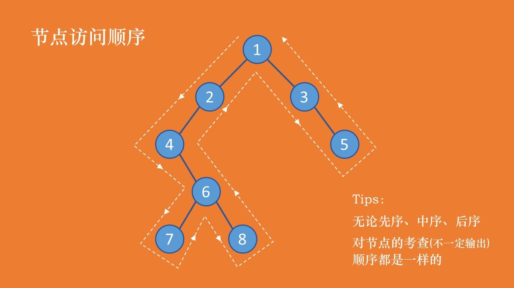

# 数据结构--树

### [先序、中序、后序遍历](https://www.jianshu.com/p/456af5480cee)

先序：考察到一个节点后，即刻输出该节点的值，并继续遍历其左右子树。(根左右)
中序：考察到一个节点后，将其暂存，遍历完左子树后，再输出该节点的值，然后遍历右子树。(左根右)
后序：考察到一个节点后，将其暂存，遍历完左右子树后，再输出该节点的值。(左右根)
Tips：无论先序、中序、后序，对节点的考查（不一定输出）顺序都是一样的。

